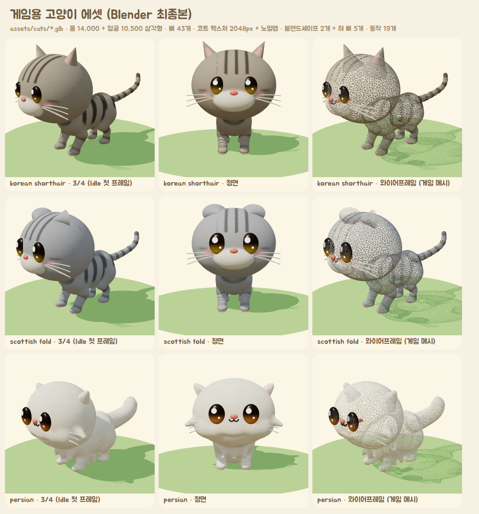
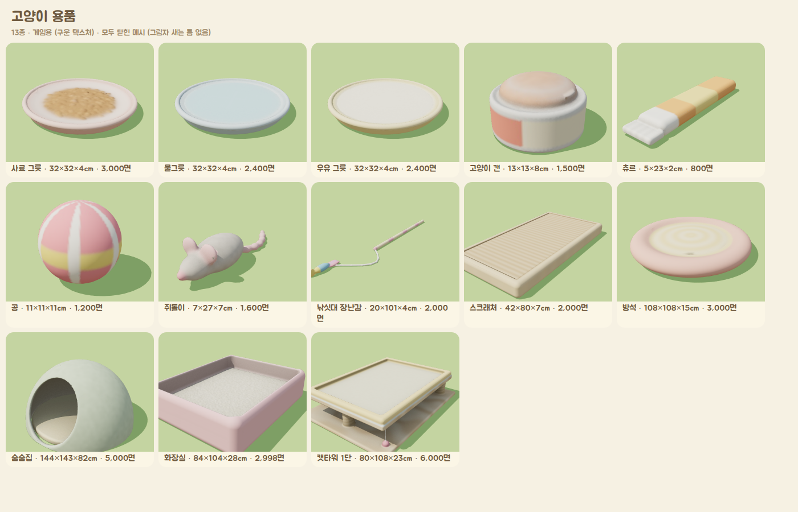
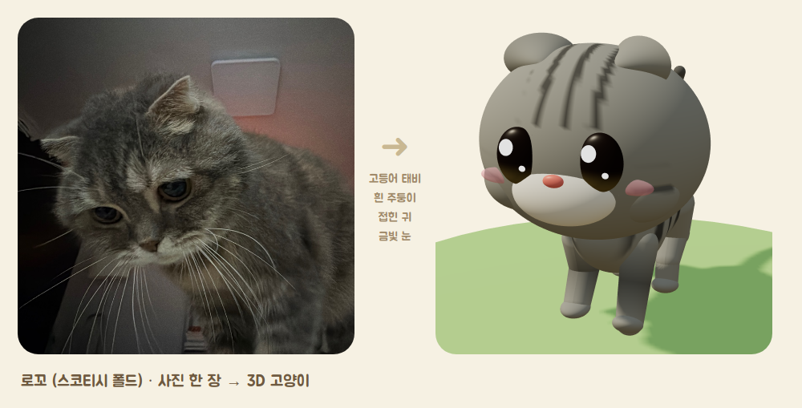
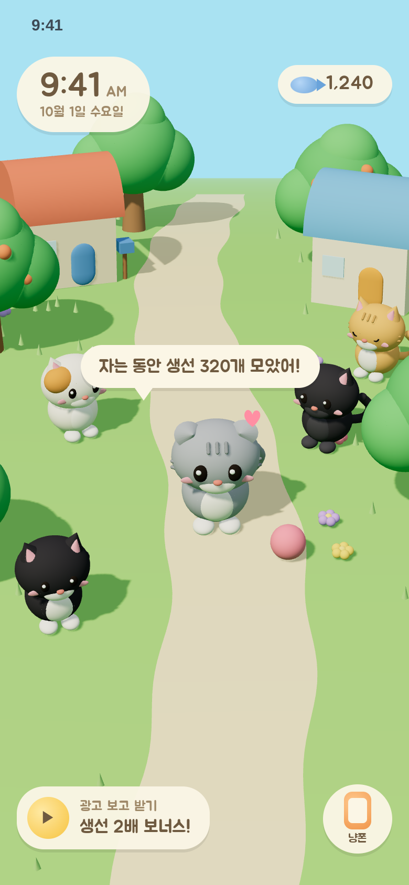

# Cat Island (가칭)

동물의 숲 그래픽 스타일의 **방치형 고양이 키우기** 게임 (iPhone, Unity).
핵심 기능은 **사진으로 나만의 고양이 만들기**이고, 무지개다리를 건넌 고양이를 위한 **별나라** 추억 공간이 있다.

- `assets/cats/`: **Unity용 게임 에셋** (FBX / glb). 이음새 없는 스킨 메시, 뼈 43개(혀 5개 포함), 코트 텍스처 + 노멀맵, 발바닥 젤리, 표정 블렌드셰이프, 실제 고양이 데이터 기반 동작 21개(혀와 발이 실제로 닿는 그루밍 3종, 우유 마시기, 입술 핥기 포함). 코숏, 스코티시 폴드, 페르시안
- `assets/items/`: **고양이 용품 13종** (FBX / glb): 사료·물·우유 그릇, 캔, 츄르, 공, 쥐돌이, 낚싯대, 스크래처, 방석, 숨숨집, 화장실, 캣타워. 고양이가 실제로 쓰는 자리(그릇에서 마시기, 캣타워 점프, 방석에서 자기, 숨숨집, 쥐돌이 치기)는 품종마다 맞춰져 있고, 겹침 없이 닿는지 자동 점검한다 → `docs/ITEMS.md`
- `docs/GAME_PLAN_FULL.md`: **게임 기획서 전체 (기획만, 한 문서)** — 게임 기획 + 수익 기획 + 디자인 스타일 + 만드는 조건. 다른 사람이나 다른 Claude에게 기획을 넘길 때
- `docs/PROJECT_BRIEF.md`: **프로젝트 전체 안내서** (일하는 방식, 기획·디자인·수익·엔진 요약, 만든 것, 결정 기록, 지금 상태와 다음 할 일). 다른 사람이나 다른 Claude에게 넘길 때 이 문서부터
- `docs/GAME_DESIGN.md`: 게임 기획 (반복 구조, 고양이 시스템, 손님 고양이, 섬 꾸미기, 처음 7일, 별나라, 출시 범위)
- `docs/ART_STYLE.md`: 디자인 스타일 (색표, 고양이 비율, 재질·조명, 카메라, 화면, 소리, 성능 기준)
- `docs/ENGINE.md`: 엔진 검토 (Unity 6 유지, 다른 후보와 비교)
- `docs/BUSINESS_PLAN.md`: 수익 기획 (보상형 광고, 결제 상품, 용품 경제, 월 순수익 500만원에 필요한 이용자 수)
- `docs/GAME_MODEL.md`: 게임 모델 v2와 동작 데이터 (만드는 과정, 뼈대, 동작 목록, Unity에서 쓰는 법)
- `docs/CAT_CATALOG.md`: 품종과 털 무늬 조사, 3D 고양이 파라미터 설계, 사진 → 고양이 변환 계획
- `prototype/3d/`: three.js 프로토타입과 에셋 제작 도구
  - 게임 모델 생성기 (`catmodel.js`, `sdfmesh.js`), 동작 데이터 (`catmotion.js`), Blender 마무리 (`blender_finish.py`)
  - 파라미터 방식 외형 설계 생성기 (`catgen.js`)
  - 품종 33종과 털 무늬 12종 카탈로그
  - 마을 그래픽 시안
  - 사진 → 고양이 변환 (`photo.html`, `photo2cat.js`)
  - 품종별 전신 점검 (`fullbody.html`)
  - 동작 점검 (`qa.mjs`), 용품과 함께 점검 (`qa_items.mjs`), 용품 생성기 (`items.js`, `blender_items.py`)

