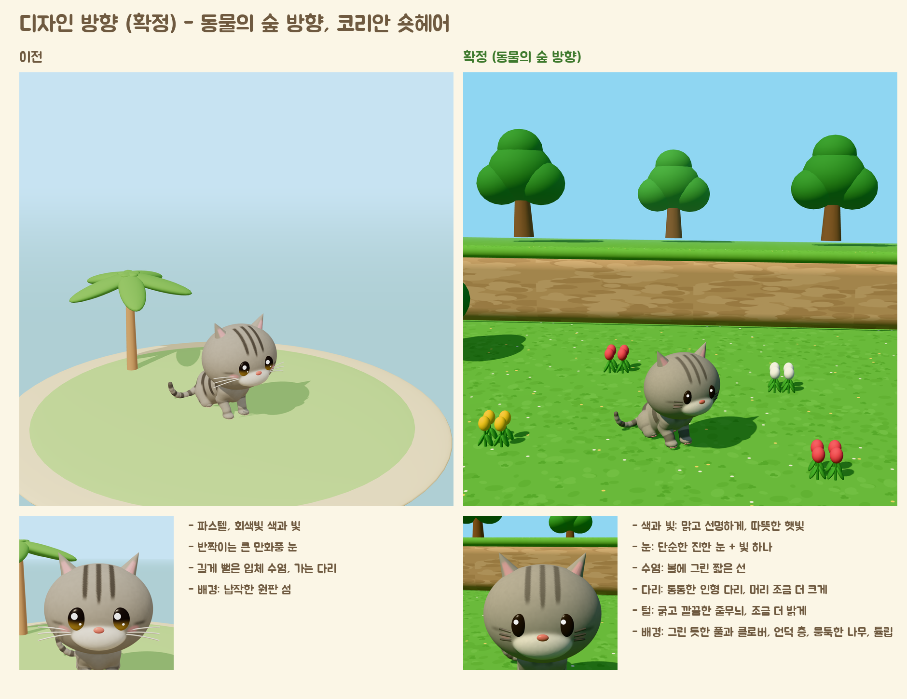
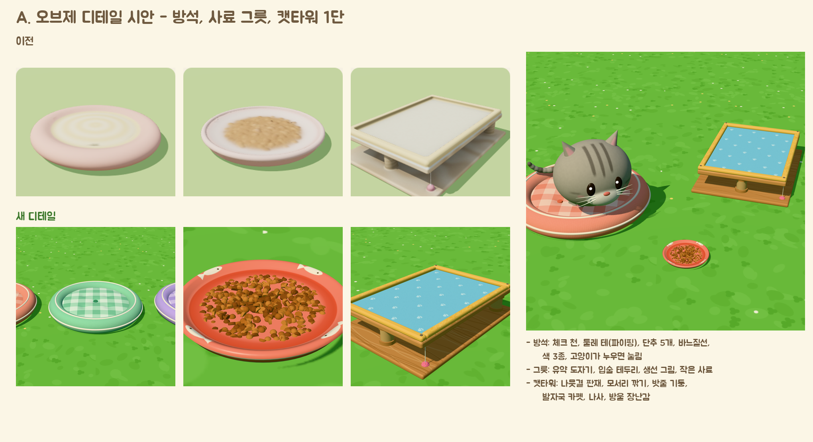
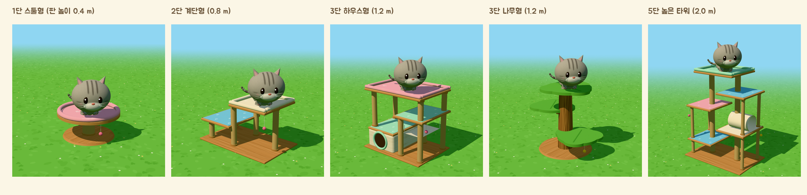

# 디자인 방향 (확정): 동물의 숲 방향

> 2026-10-05 사용자 확정. **고양이와 배경의 생김새는 이 문서를 따른다.** `ART_STYLE.md`와 다른 내용이 있으면 이 문서가 우선한다.
> 화면(UI)·로고·말투는 `BRAND.md`. 이 문서는 게임 속 세상(고양이, 땅, 나무, 바다, 용품, 빛)의 기준이다.

- 시안을 다시 만드는 명령: `cd prototype/3d && python3 brand_shot.py style_compare.html "side=ac&dist=6.4&el=.36" ac.png 900 900` (`side=now`는 이전 모습)
- 시안 코드: `prototype/3d/style_compare.html`, 고양이는 `buildCatModel(shape, coat, { style: 'ac' })`.

---

## 1. 한 문장
**"햇살 쨍한 오후, 장난감 같은 섬에서 사는 통통한 고양이들."**
이전의 '연한 파스텔'에서 **맑고 선명한 색, 또렷한 햇빛, 인형 같은 고양이**로 바꾼다. 동물의 숲처럼 보이게 하는 것은 '분위기'이고, 모양·캐릭터·마크는 우리 것이다 (8장).

## 2. 색과 빛

### 2-1. 빛 (Unity URP, 시안 값)
| 항목 | 값 | 이전 |
|---|---|---|
| 색 보정(톤 매핑) | **Neutral**, 노출 1.0 | ACES, 1.1 (색이 바래 보였음) |
| 해 | 색 `#FFF0D0`, 세기 3.1 (three.js 기준. Unity에서는 같은 인상이 되게 맞춘다), 높이 약 50°, 왼쪽 앞에서 | `#FFF1D6`, 2.0 |
| 하늘빛(주변광) | 위 `#CDEEFF` / 아래 `#7FB85A`, 1.15 | 위 `#F4FBFF` / 아래 `#C9B892`, 1.7 |
| 그림자 | 부드럽게 (반경 3), 해상도 4096, 진하기는 해 세기로 (검지 않게) | 반경 4, 연함 |
| 안개(먼 곳) | 하늘색 `#8FD6F2`, 카메라에서 9~20 m | 하늘색, 4~9 m |

- 명암이 또렷해야 한다: 해 쪽은 밝고 따뜻하게, 그늘은 푸르스름하게 (검정 금지).
- 시간대 변화(아침·저녁·밤)는 `ART_STYLE.md` 4-2를 따르되, 같은 '맑음'을 유지한다 (저녁도 탁하지 않게).

### 2-2. 세상의 색표
| 이름 | HEX | 쓰는 곳 |
|---|---|---|
| 풀 | `#74C254` (밝은 무늬 `#7CC85B`, 어두운 무늬 `#6DBB4E`, 클로버 `#63B247`) | 땅 |
| 하늘 | `#8FD6F2` | 하늘, 먼 안개 |
| 바다 | `#3FC4DC` | 깊은 물 |
| 얕은 물 | `#8EE6E4` | 바닷가 띠 |
| 모래 | `#F5E2A8` (알갱이 `#ECD595`, `#FBEFC6`) | 해변 |
| 절벽 | `#C9A57A` (돌 무늬 `#BD9970`, `#D4B288`) | 언덕 층 옆면 |
| 나무 잎 | `#3F9A3E`, `#4AA845` | 나무 |
| 나무 줄기 | `#8B5E3C` | 나무, 나무 용품 |
| 꽃 | 빨강 `#FF5D6C`, 노랑 `#FFD23F`, 하양 `#FFFFFF` | 튤립 등 |

- 화면 UI 색(`BRAND.md` 7장)은 그대로다. UI는 크림 바탕의 부드러운 색, 세상은 맑고 선명한 색: 둘이 섞이지 않게 UI 판은 크림색 둥근 카드 위에 올린다.

## 3. 고양이

`buildCatModel(..., { style: 'ac' })`가 아래를 모두 한다. **이 스타일을 기본으로 바꾸고 33품종을 다시 만든다** (9장).

| 부분 | 확정 | 이전 |
|---|---|---|
| 눈 | **세 가지 중 고양이마다 하나** (아래 3-1). 기본은 진한 눈 한 덩어리(`#2A201B`) + 왼쪽 위 작은 빛 하나 | 품종 눈 색 그라데이션 + 빛 두 개 |
| 수염 | **세 가지 중 고양이마다 하나** (아래 3-1): 주둥이 옆에서 밖으로 뻗고 끝으로 갈수록 가늘어지는 진짜 수염 3개씩. 털이 밝으면 연한 회갈색 `#D9CFC2` | 얼굴 밖으로 길게 뻗은 흰 선 |
| 볼 터치 | 작고 연하게 (이전의 70%) | |
| 머리 | 1.08배 | |
| 다리 | 굵기 1.3배, 발 1.18배 (인형 다리) | |
| 털 무늬 | **굵고 깔끔하게**: 줄무늬 수를 줄이고 가장자리를 선명하게 (`coat.bold`) | 가늘고 많은 줄무늬 |
| 털 색 | 전체를 10% 밝게 (`#FFF8EC` 쪽으로) | |
| 털 질감 | 보송한 털 요철은 약하게 (노멀맵 세기 절반 이하). 큰 덩어리로 읽히게 | 털 결이 보임 |
| 표정 | 감은 눈은 지금처럼 'U' 모양 | |
| 눈 테두리 (정리 필요) | 아이라이너·눈꺼풀이 있는 품종(벵갈 등)은 진한 눈 둘레에 안경처럼 보인다 → 새 눈에 맞게 다시 맞춘다 | |

### 3-1. 눈과 수염은 고양이마다 고른다 (사진 고양이 때문에)
우리 고양이는 정해진 캐릭터가 아니라 **이용자의 사진을 닮게 만든다.** 그래서 눈과 수염은 품종에 묶지 않고 **세 가지씩 모두 넣어 고양이마다 하나를 고른다.**

| 종류 | 선택지 | 사진에서 자동으로 고르는 기준 (`photo2cat.js` `suggestFace`) |
|---|---|---|
| 눈 `eyeStyle` | `dark` 진한 눈 + 빛 하나 / `iris` 고양이 눈 색 + 둥근 진한 눈동자 / `rim` 진한 눈 + 옅은 테두리 | 얼굴·털이 어두우면(밝기 30 미만) `iris` (진한 눈이 털에 묻히므로), 털이 중간 어둡기이고 눈 색이 선명하면 `iris`, 그 밖은 `dark`. `rim`은 이용자가 고르는 선택지 |
| 수염 `whiskerStyle` | `short` 짧은 수염 / `long` 긴 수염 / `dots` 짧은 수염 + 수염 점 | 긴 털이면 `long`, 점박이·틱드 무늬면 `dots`, 그 밖은 `short` |

- 고르는 순서: 게임에서 이용자가 고른 값 → 사진 제안(코트 값 `coat.eyeStyle`, `coat.whiskerStyle`) → 품종 기본(`catgen.js` `WHISKER_STYLE`: 큰 장모종은 긴 수염, 점박이·야생형은 수염 점) → 털 밝기 기준.
- **고양이 만들기 화면**(사진 → 고양이)에서 무늬·색·눈 색처럼 **눈 모양 3개, 수염 3개를 버튼으로 바꿀 수 있게** 한다 (기획서 1부 4장).
- 그림: `images/eye_styles.png` (눈 3가지), 수염 3가지는 시안 장면에서 `whiskers=short|long|dots`.
- 아이라이너·눈꺼풀이 있는 품종(벵갈 등)은 새 눈에서 안경처럼 보인다 → 새 눈에 맞게 다시 맞춘다.

- **같은 크기·같은 뼈대 원칙은 그대로.** 다리 굵기와 머리 크기는 모든 품종에 똑같이 적용된다 (먼치킨은 짧은 다리 그대로).
- 다리가 굵어지고 머리가 커져서 **동작의 닿음·겹침이 달라진다.** 그루밍(발이 얼굴에 닿기), 귀 긁기, 마시기, 앞발 장난, 점프 착지를 반드시 다시 점검한다 (`qa.mjs`, `qa_items.mjs`).
- 더 나아갈 것 (선택, 시안 뒤): 꼬리를 조금 더 굵고 단순하게, 귀 안쪽 분홍을 더 선명하게.

## 4. 땅과 배경

| 요소 | 기준 |
|---|---|
| 풀밭 | **손으로 그린 듯한 무늬 텍스처**: 바탕 풀색 위에 조금 밝고 어두운 둥근 얼룩, 세 잎 클로버, 아주 작은 흰·노란 꽃 점. 반복이 눈에 띄지 않게 큰 크기로 깐다. 사실적인 풀잎 하나하나는 그리지 않는다 |
| 언덕 층 | 땅은 **계단식**: 높이 약 0.8 m(고양이 키의 약 1배)씩, 옆면은 둥근 돌 무늬의 모래색 절벽, 위는 풀. 모서리는 둥글게 (반지름 0.18 m) |
| 나무 | **뭉툭한 장난감 나무**: 짧은 줄기 + 큰 동그란 잎 덩어리 3~4개. 잎은 진한 초록 두 가지. 나무마다 크기·색을 조금씩 다르게 |
| 꽃 | 튤립 같은 단순한 꽃을 3~4송이씩 모아 심는다 (빨강·노랑·하양) |
| 바다와 해변 | 모래 띠 → 얕은 물 띠 → 청록 바다. 물은 반짝임 약하게 |
| 둥근 세상 | **멀어질수록 땅이 둥글게 아래로 휜다** (동물의 숲의 굴러가는 통나무 같은 지평선). 정점 단계에서 카메라 앞 2 m 뒤부터 `y -= 0.03 × 거리²`. Unity에서는 모든 세상 재질(`SoftLit` 포함)에 같은 휨을 넣는다 |
| 먼 풍경 | 하늘색 안개로 부드럽게. 원하면 아주 약한 흐림(URP 피사계 심도, 가우시안)을 먼 곳에만 |

## 5. 용품 (A단계 확정, 2026-10-05)

시안 코드: `prototype/3d/items_detail.html` (`shot=hero|variants|bowl|tower|stool|stairs|house|tree|tall|towers`, `cat=<품종>`으로 고양이를 올려 크기 확인).

### 5-1. 디테일 기준 (모든 용품)
| 항목 | 기준 |
|---|---|
| 모양 | 장난감처럼 둥글되 **각이 살아 있게**: 나무·판은 모서리 반지름 1~1.5 cm로 깎은 상자(둥근 덩어리 하나로 뭉개지 않는다), 천은 부풀린 쿠션 모양 |
| 질감 | 그린 듯한 무늬 텍스처: 천(체크·짜임), 나뭇결(판재 결·옹이), 도자기 유약(띠·그림), 밧줄(꼬인 줄), 카펫(보풀 + 발자국 무늬), 나무껍질. 사실적인 사진 질감은 쓰지 않는다 |
| 작은 부품 | 용품마다 2~4개: 둘레 테(파이핑), 단추, 바느질선, 나사 머리, 나무 고리, 방울·끈 장난감, 손잡이, 꼬리표 |
| 색 | 맑고 진하게 (2장 색표와 어울리게). **색 바꾸기 2~3종**을 기본으로 (수집 재미) |
| 반응 | 방석은 고양이가 누우면 눌리고, 공은 구르고, 낚싯대·방울은 흔들린다 (C단계에서 움직임 연결) |
| 크기와 높이 | 바꾸지 않는다: 사료·물 표면 `BOWL_SURF`, 쥐돌이 `TOY_TOP`, 방석 윗면, 숨숨집 바닥 → 동작을 다시 맞출 필요 없음 |
| 그림자 | 부품 하나하나가 닫힌 메시 (그림자가 새지 않게, `ITEMS.md`) |

### 5-2. 용품 13종 적용
| 용품 | 적용 |
|---|---|
| 방석 | 시안 그대로: 체크 천 윗면, 부푼 둘레 롤, 흰 파이핑 2줄, 바느질선, 단추 5개(오목한 홈), 색 3종(복숭아·민트·라일락), 누우면 눌림 |
| 사료 그릇 | 시안 그대로: 유약 도자기, 두꺼운 입술 테두리, 생선 그림 4마리, 흰 테 줄, 사료 더미(둥근 알갱이 + 납작 알갱이) |
| 물그릇 / 우유 그릇 | 사료 그릇과 같은 모양, 그림만 다르게: 물방울(물), 젖소 무늬(우유). 물·우유 표면은 살짝 반짝이게 |
| 고양이 캔 | 둥근 캔 + 종이 상표(생선 그림, 우리 로고 색), 따개 고리 |
| 츄르 | 줄무늬 포장지 + 끝 톱니 모양, 짜낸 자국 |
| 공 | 털실 공(실 감긴 무늬, 삐져나온 실 한 가닥) |
| 쥐돌이 | 펠트 몸통 + 바느질선 + 둥근 귀 + 끈 꼬리 + 코 단추 |
| 낚싯대 | 나무 막대(결) + 끈 + 깃털 2~3개 + 방울 |
| 스크래처 | 골판지 단면 줄무늬가 보이는 옆면 + 위에 생선 그림 인쇄 + 나무 틀 |
| 숨숨집 | 펠트 이글루 + 바느질선 + 지붕에 작은 고양이 귀 2개 + 문 둘레 테 |
| 화장실 | 둥근 통 + 뚜껑 이음선 + 모래 알갱이 + 걸린 삽 |
| 캣타워 | 5-3의 부품으로 조립 |

### 5-3. 캣타워: 부품 묶음과 5종
- **부품** (`items_detail.html`의 `KIT`): 밧줄 기둥(위아래 나무 고리), 판(나무 + 카펫), 침대 판(푹신한 테), 둥근 판, 정육면체 숨숨집(동그란 문), 해먹, 잎 모양 판, 나무껍질 기둥, 터널, 방울 장난감, 나사.
- **판 높이는 0.4 m 단위** (`STEP`). 고양이가 착지하는 판은 0.6 × 0.7 m 이상 (메인쿤 네 발).

| 디자인 | 높이 | 구성 |
|---|---|---|
| 1단 스툴형 | 0.4 m | 굵은 밧줄 기둥 + 둥근 침대 |
| 2단 계단형 | 0.8 m | 엇갈린 판 2개, 위는 침대 |
| 3단 하우스형 | 1.2 m | 숨숨집(지붕이 1층 판) + 해먹 + 판 + 맨 위 큰 침대 |
| 3단 나무형 | 1.2 m | 나무껍질 기둥 + 잎 모양 판 3개 (섬 테마) |
| 5단 높은 타워 | 2.0 m | 다섯 층 + 터널 + 장난감 2개 |

- **점프:** 지금 `JumpUp`은 0.2 m만 오른다. 새 캣타워는 **0.4 m 점프와 뛰어내리기**가 필요하다 → B단계에서 만든다. 그 전까지 게임에서는 지금의 낮은 1단(`cat_tower_1`)을 쓰고, 새 캣타워 5종은 파일만 만들어 둔다.

## 6. 카메라
- 게임 시점은 그대로 (위에서 35~45° 비스듬히, 좁은 화각). 둥근 세상 휨 덕분에 멀리 하늘이 보인다.

## 7. 점검 기준 (바뀐 것)
- 기존 점검(겹침 4 mm, 닿음 3 mm 등)은 그대로. 고양이를 바꾼 뒤 대표 8품종으로 먼저 확인하고, 통과한 뒤 33품종을 만든다.
- 그림 확인: 각 품종을 시안과 같은 장면(`style_compare.html side=ac`)에서 찍어 한 장에 모아 본다. 눈·수염이 모든 털색에서 보이는지 (검은 고양이: 수염 선이 안 보이면 밝은 회색으로), 줄무늬가 깨지지 않는지.

## 8. 따라 하지 않는 것 (저작권·상표)
- 동물의 숲의 **캐릭터, 나뭇잎 마크, 휴대폰(노크폰) 화면, 글꼴(Humming 등 유료 글꼴), 음악·효과음, 특정 가구·옷 모양**을 흉내 내지 않는다.
- 따라 하는 것은 '맑은 색, 장난감 같은 덩어리, 그린 듯한 질감, 둥근 세상' 같은 일반적인 분위기뿐이다.

## 9. 작업 순서 (터미널)
1. `catmodel.js`: `style: 'ac'`를 기본으로 (이전 모습은 `style: 'classic'`으로 남김). 사진 고양이(`photo2cat.js`)도 같은 길로.
2. 대표 8품종(코리안 숏헤어, 페르시안, 메인쿤, 오리엔탈, 스핑크스, 스코티시 폴드, 브리티시, 먼치킨)으로 `makeClips`의 `skippedClips`, `qa.mjs`, `qa_items.mjs` 확인 → 다리·머리 변경으로 깨진 동작 고치기.
3. `blender_finish.py`: 털 노멀맵 세기 낮추기. 가능하면 털 무늬를 텍스처 칸마다 직접 계산 (줄무늬 가장자리 깔끔하게; `PROJECT_BRIEF.md` 8장 메모).
4. 33품종 다시 만들기 → `assets/cats/` 교체 → `unity/tools/sync_art.py`.
5. 용품: 5장 기준대로 13종 다시 만들기 + 캣타워 5종 (`items_detail.html`의 모양을 게임 파일로) → 다시 내보내기 → `qa_items.mjs`.
6. Unity: 빛·톤 매핑·안개 (2장), 풀·절벽 텍스처, 언덕 층, 나무, 꽃, 바다, 둥근 세상 휨 (4장).
7. 그림 확인 (7장) → 문서 그림 갱신(`docs/images/`) → 커밋.

## 10. 움직임 (B단계 기준, 2026-10-05)

시안 코드: `prototype/3d/motionfeel.js` (덧입히는 움직임 층), `anim_b.html` + `anim_shot.py` (비교 영상), 영상 `docs/videos/`.
**사용자 피드백으로 정한 것:** 쓰다듬을 때 손은 화면에 나오지 않는다 / 걷기는 통통 튀지 않고 진짜 고양이처럼 / 점프는 높이마다 다르게.

### 10-1. 원칙
- 계산된 동작(`catmotion.js`) 위에 **움직임 층**을 실시간으로 덧입힌다 (Unity로 옮긴다). 같은 동작이어도 매번 조금씩 다르게 보인다.
- 꼬리·귀: 스프링처럼 몸을 한 박자 늦게 따라오고 살짝 넘쳤다 돌아온다 (`SpringBones`, 세계 공간).
- 눌림과 늘어남: **점프·착지·뛰어내리기에만** (`Squash`, 부피 유지, 발 기준). 걷기에는 쓰지 않는다.
- 준비 동작: 큰 동작 앞에 잠깐 멈추는 박자 (`holdRemap`).
- 발이 미끄러지면 안 된다 (루트 이동 속도와 동작 속도 일치, 정지·출발은 몇 걸음에 걸쳐 감속·가속).

### 10-2. 걷기 (진짜 고양이처럼)
- 같은 쪽 뒷발 → 앞발 순서(측대보 순서), 좁은 발자국, 뒷발이 앞발 자국 근처에 놓임, 어깨뼈가 번갈아 솟음 (이미 `gaitPose`에 있음).
- **위아래 튐 없음.** 몸통은 미끄러지듯, **머리는 수평으로 차분히** (`HeadSteady`).
- 꼬리는 높게 들고 끝을 살짝 말아(물음표) 천천히 흔든다. 귀는 앞으로.
- 방향 전환: 머리가 먼저 돌고 몸이 따라 돈다. 출발·정지: 2~3걸음에 걸쳐 속도 변화.

### 10-3. 점프 (높이마다 다르게)
- 대표 동작을 높이별로 만든다: **오르기 0.2 / 0.4 / 0.8 m, 뛰어내리기 같은 높이 3개** (`catmotion.js` `opts.jumpH`). 1 m 이상은 **앞발로 걸치고 뒷발로 기어오르기** 동작을 따로.
- Unity에서 실제 높이·거리에 맞게 가까운 두 동작을 섞고, 착지할 때 발을 판 위에 정확히 놓는다 (발 IK).
- 높을수록: 위를 올려다보는 시간이 길고(`jumpAnticipation`: 0.2 m 0초 → 0.8 m 약 0.45초), 엉덩이 씰룩임이 길고, 웅크림이 깊고, 착지 눌림이 크다. 꼬리는 균형추처럼 움직인다.
- 뛰어내리기: 앞발을 먼저 아래로 뻗어 거리를 재고 내려간다. 높을수록 몸을 길게 늘여 내려간다.

### 10-4. 쓰다듬기 (손은 화면에 없음)
- 이용자의 손가락이 손이다. 손가락이 닿는 곳에만 은은한 빛 표시.
- 반응 (`PetReaction`): 손가락 쪽으로 머리를 기울여 밀어 올림, 눈 지그시 감기, 귀 편하게 뒤로, 꼬리 올려 천천히 살랑, 골골송 떨림(진동과 소리 함께, `CatHaptics`), 하트.
- 부위별 반응: 턱·이마·볼은 좋아함(반응 큼), 등은 보통, 배는 오래 만지면 살짝 깨무는 시늉(아프지 않게, 기획서 2-1). 성격에 따라 좋아하는 부위가 다르다.

### 10-5. 가만히 있을 때
- 성격별 버릇(기획서 3-2)을 섞어 매번 다르게: 귀 쫑긋, 두리번, 코 핥기, 하품, 꼬리 끝만 톡톡, 천천히 눈 깜빡이기(신뢰 표시).

## 11. 게임 반응 (C단계 기준)
- 소리: 발소리(풀·나무·카펫마다 다르게), 착지 '통', 골골송, 짧은 야옹, 용품 놓을 때 소리. 기존 Unity 소리 체계에 맞춘다.
- 작은 효과: 착지·달리기의 작은 먼지, 하트·음표, 새 용품 처음 쓸 때 느낌표 말풍선, 놓을 때 '통' 튀는 크기 변화와 반짝임.
- 용품 반응: 방석 눌림(고양이 몸에 맞춰), 공 굴림(물리), 낚싯대·방울 흔들림, 해먹 처짐, 나무 잎 살랑.
- 카메라: 고양이를 살짝 늦게 부드럽게 따라감, 쓰다듬을 때 천천히 가까이, 화면 흔들림 없음.
- 화면 버튼: 누를 때 살짝 눌렸다 튀어나오는 반응 + 작은 소리. 말투는 `BRAND.md` 10장.
