# 고양이 외형 카탈로그 (3D 파라미터 설계)

이 게임의 핵심 기능은 **사진으로 나만의 고양이 만들기**다.
그래서 고양이 하나를 두 축의 조합으로 정의한다.

```
고양이 = 체형 (품종 프리셋) × 털 (색 + 무늬)
```

사진 분석 결과는 두 축에 각각 들어간다.
- 체형: 귀 모양, 얼굴, 털 길이, 다리 길이
- 털: 바탕색, 무늬색, 무늬 종류, 흰 털 비율, 눈 색

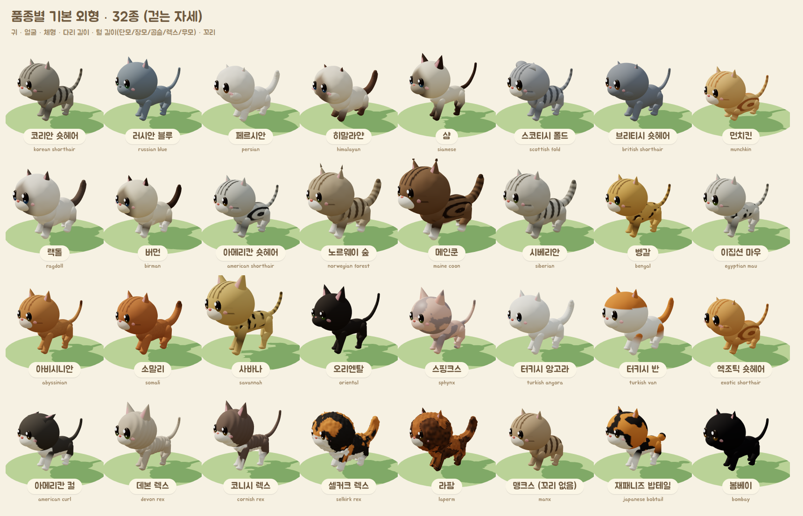
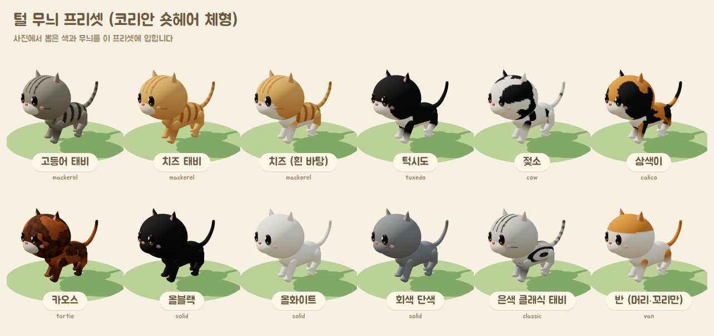
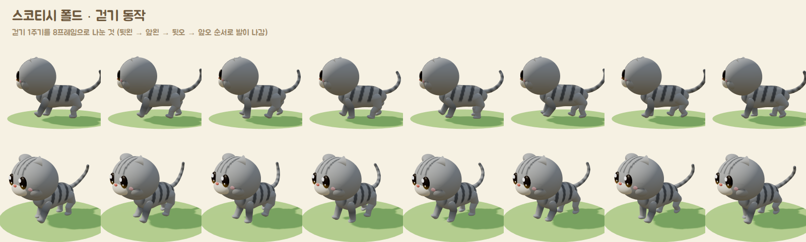
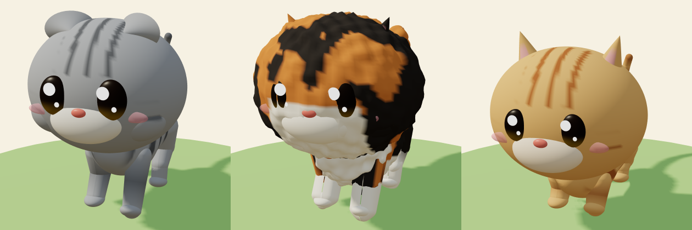
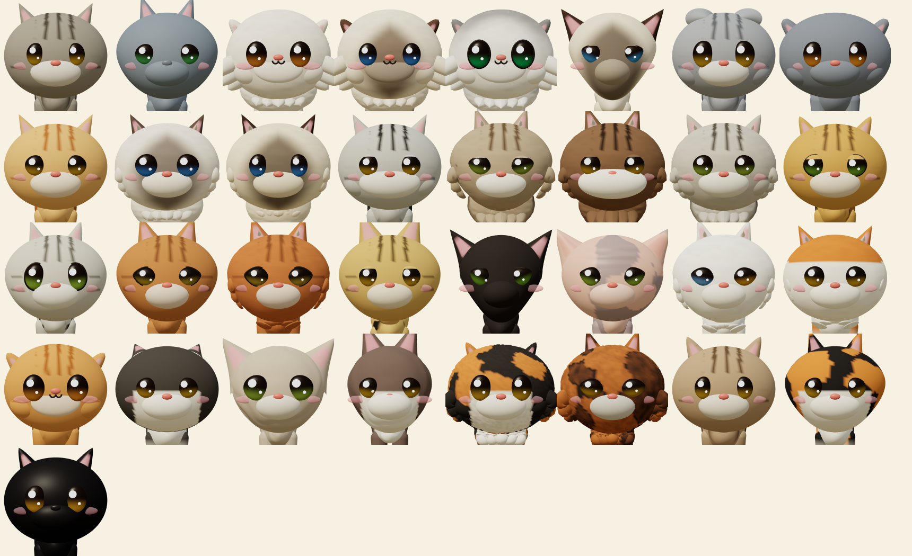
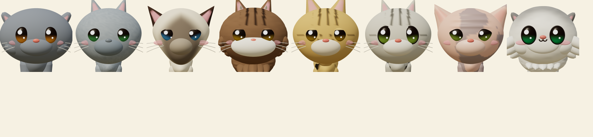
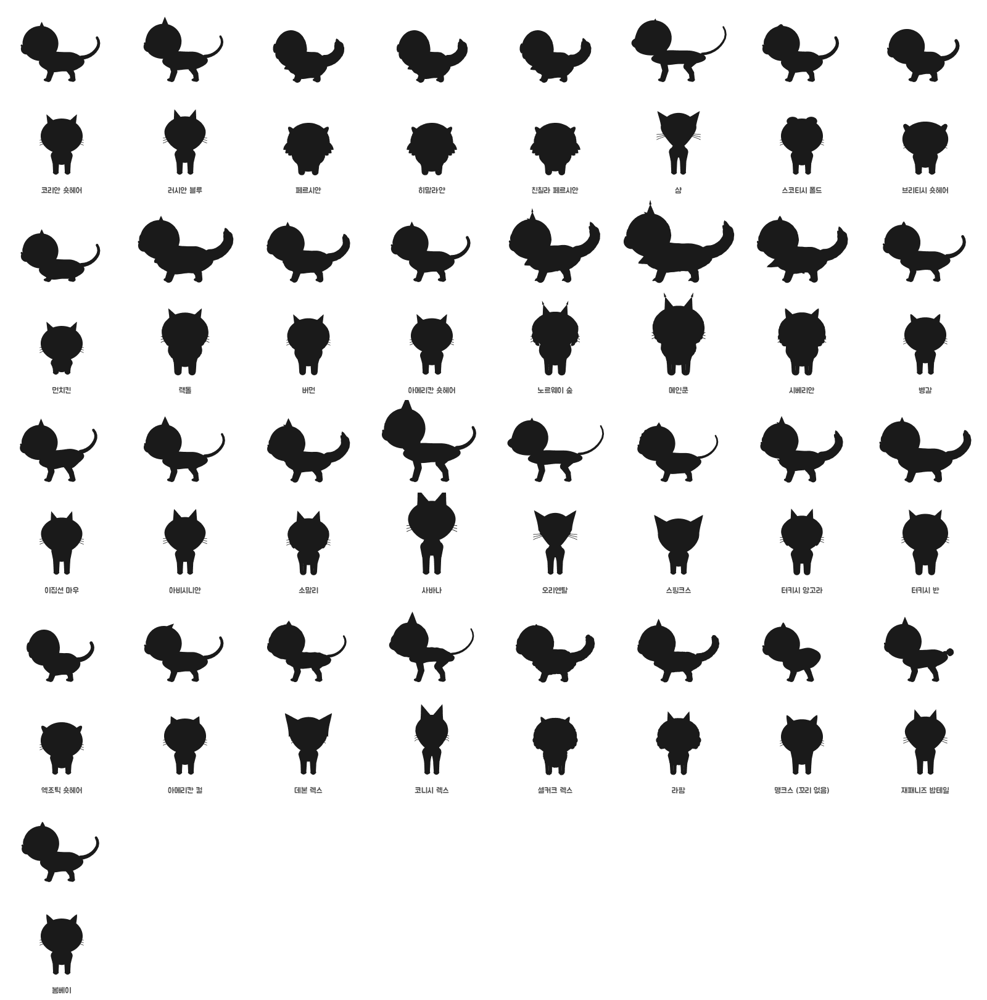

**얼굴 원칙 (동물의 숲 스타일):**
- 눈은 크고 동그란 까만 유광 눈에 큰 하이라이트와 작은 하이라이트를 넣는다.
- 하이라이트는 눈 표면에 붙은 납작한 원이고, 두 눈 모두 같은 빛 방향(왼쪽 위)에 놓는다.
- 장모와 곱슬 품종은 털이 눈을 덮지 않도록 눈을 앞으로 뺀다.
- 품종별 눈 색은 눈 아래쪽에 은은하게만 비친다. 세로 동공과 사실적인 홍채는 쓰지 않는다.
- 작은 ω 입과 볼터치를 넣는다.
- 머리 대 몸 비율을 키운 아기자기한 비율(머리 1.5배, 다리 0.8배)을 쓰되, 네 발 보행 구조는 유지한다.

## 0. 모델 구조 (움직임 고려)

고양이는 관절로 이어진 뼈대(리그) 구조다. 공처럼 둥근 몸이 아니라 세 덩어리로 나눴다.
- 가슴: 깊다.
- 허리: 가늘다.
- 골반: 둥글다.

```
root
 └ body (걸을 때 위아래로 흔들림)          가슴 · 허리 · 골반
    ├ neck ─ head                         귀, 주둥이, 눈, 볼
    ├ frontL/R : upper ─ lower ─ paw      앞다리 3마디
    ├ hindL/R  : thigh ─ shin ─ hock ─ paw  뒷다리 4마디 (고양이 특유의 뒤꿈치 각도)
    └ tail0 … tail9                       꼬리 10마디 (밥테일 3마디, 맹크스 없음)
```

- `setPose(cat, 'walk', phase)`는 고양이의 실제 걸음 순서를 따른다(뒷왼 → 앞왼 → 뒷오 → 앞오, phase 0~1).
  - 다리 스윙, 발 들기, 몸통 흔들림, 목 끄덕임, 꼬리 흔들기를 계산한다.
- 이 계층은 Unity Transform 리그로 1:1 옮길 수 있다. 같은 계산식을 Animator 또는 코드 애니메이션으로 사용한다.

## 1. 품종 목록 (33종)

**일반 품종**
코리안 숏헤어, 러시안 블루, 페르시안, 히말라얀, 친칠라 페르시안, 샴, 스코티시 폴드, 브리티시 숏헤어, 랙돌, 버먼, 아메리칸 숏헤어, 노르웨이 숲, 메인쿤, 시베리안, 벵갈, 이집션 마우, 아비시니안, 소말리, 오리엔탈, 터키시 앙고라, 터키시 반, 엑조틱 숏헤어, 봄베이

**특수 외형 품종**
- 짧은 다리: 먼치킨
- 곱슬털: 셀커크 렉스, 라팜
- 웨이브털: 데본 렉스, 코니시 렉스
- 무모: 스핑크스
- 귀가 뒤로 말림: 아메리칸 컬
- 큰 귀와 긴 다리: 사바나
- 꼬리 없음: 맹크스
- 방울 꼬리: 재패니즈 밥테일

## 1-1. 조사 근거

- **국내 사육 품종 순위:** KB금융 「한국 반려동물 보고서」(2021) 기준이다. 코리안 숏헤어가 가장 많고, 러시안 블루, 페르시안, 샴이 뒤를 잇는다. 최근에는 스코티시 폴드와 브리티시 숏헤어도 인기다.
- **국내 털 무늬 호칭:** 고등어, 치즈, 턱시도, 젖소, 삼색, 카오스, 포인트.
- **유전학 분류:** 태비 4종(고등어/클래식/점박이/틱드), 바이컬러 계열(턱시도/젖소/반), 삼색(칼리코), 카오스(톨티), 컬러포인트.
- **외형 레퍼런스:** 핀터레스트 품종 도표 2종(40여 품종이 라벨링된 일러스트).

## 2. 체형 파라미터 (`SHAPE_DEFAULT`)

| 파라미터 | 의미 | 값 범위와 예 |
|---|---|---|
| `ear` | 귀 형태 | `upright` 기본 / `fold` 스코티시 폴드 / `curl` 아메리칸 컬 / `large` 샴·오리엔탈·사바나·렉스·스핑크스 / `small` 페르시안·브리티시 |
| `earSize` | 귀 크기 | 0.7 페르시안 ~ 1.55 데본 렉스 |
| `earTuft` | 귀 끝 털 | 0 또는 1 (메인쿤, 노르웨이 숲) |
| `headW` / `headH` | 머리 가로·세로 | 브리티시는 넓게, 샴은 좁게 |
| `faceFlat` | 납작한 얼굴 | 0 ~ 1 (페르시안, 엑조틱) |
| `cheek` | 볼살 | 0 ~ 1 (브리티시, 엑조틱) |
| `eyeSize` / `eyeShape` | 눈 크기와 모양 | 기본은 크고 둥근 까만 눈, `almond`는 살짝 넓게 / `eye` 색은 눈 아래쪽에 은은하게 반영 |
| `size` | 전체 크기 | 메인쿤 1.22, 사바나 1.15 |
| `bodyLen` / `bodyBulk` | 몸 길이와 체격 | 0.78 오리엔탈 ~ 1.15 브리티시 |
| `legLen` / `legBulk` | 다리 길이와 굵기 | 0.5 먼치킨 ~ 1.35 사바나 |
| `muzzleLen` | 주둥이 길이 | 샴·오리엔탈은 길게 |
| `fur` | 털 종류 | `short` / `long` 장모 / `curly` 곱슬(셀커크 렉스, 라팜) / `rex` 짧은 웨이브(데본, 코니시) / `none` 무모(스핑크스) |
| `furAmount` / `ruff` | 털 양, 목 갈기 | 장모종 |
| `faceFluff` | 볼·턱 털 양 | 페르시안 계열 1.2, 메인쿤 같은 반장모는 기본 .55 (얼굴은 짧은 털) |
| `tail` / `tailLen` / `tailFluff` | 꼬리 | `normal` / `bob` 방울 꼬리(재패니즈 밥테일) / `none` 꼬리 없음(맹크스) |
| `wrinkles` | 이마 주름 | 스핑크스 |

### 2-1. 실루엣 파라미터 (품종을 색 없이 모양만으로 구분)

까만 실루엣 점검(`silhouette.html`)에서 색을 빼면 20여 품종이 코리안 숏헤어와 구분되지 않았다.
그래서 품종 표준(CFA·TICA)에서 모양으로 드러나는 특징을 파라미터로 추가했다.

| 파라미터 | 의미 | 적용 품종 |
|---|---|---|
| `wedge` | 턱으로 갈수록 좁아지는 쐐기형 머리, 긴 주둥이 | 샴·오리엔탈 1, 코니시 렉스 .5, 아비시니안·데본 렉스 .4, 러시안 블루·터키시 앙고라 .35 |
| `headTri` | 곧은 콧날의 삼각형 머리 | 노르웨이 숲, 재패니즈 밥테일 |
| `muzzleW` | 넓고 각진 주둥이 | 메인쿤 1.35, 아메리칸 숏헤어 1.2 |
| `earSet` | 귀 위치: `high` 머리 위 / `mid` / `low` 옆으로 넓게 | high: 아비시니안·메인쿤·사바나 / low: 샴·페르시안·브리티시·데본·스핑크스 |
| `earWide` | 귀 밑동 너비 | 데본 렉스 1.2, 스핑크스 1.15 |
| `earRound` | 둥근 귀 끝 (0 뾰족 ~ 1 둥글) | 브리티시 1, 페르시안·엑조틱 .8 |
| `chest` | 가슴 깊이 | 브리티시·코니시 렉스 1.15 |
| `backArch` | 둥글게 솟은 등 | 코니시 렉스 |
| `tuck` | 위로 말려 올라간 배 (그레이하운드형) | 코니시 렉스 1, 샴·오리엔탈 .4 |
| `potBelly` | 둥근 배 | 스핑크스 |
| `pouch` | 뒷배 아래 늘어진 주머니(프라이모디얼 파우치) | 이집션 마우 1, 벵갈 .5 |
| `rumpHigh` | 뒷다리가 길어 엉덩이가 높음 | 맹크스 .3, 이집션 마우 .2 |
| `neckLen` | 목 길이 | 사바나 1.3, 샴 1.2 / 페르시안 .75 |
| `tailThick` | 꼬리 굵기 | 브리티시 1.3 / 코니시 렉스 .55 (채찍 꼬리) |

- 체형 그룹: **코비형**(페르시안·브리티시·엑조틱·맹크스: 짧은 몸, 짧은 다리, 낮은 귀, 굵은 꼬리)과 **포린형**(샴·오리엔탈·코니시: 긴 몸, 긴 다리, 쐐기 머리, 가는 꼬리)이 실루엣만으로 구분된다.
- `rumpHigh`는 몸통을 앞으로 기울이고, 목이 그만큼 반대로 돌아가서 머리 높이는 유지된다.
- 납작한 얼굴(`faceFlat`)은 얼굴 앞면만 살짝 눌러서 볼과 주둥이가 함께 따라 들어가게 했다. 혹처럼 튀어나오지 않는다.

### 2-2. 장모 · 곱슬 표현

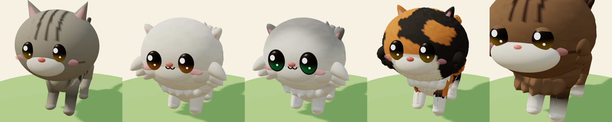

몸 전체를 털 뭉치로 울퉁불퉁하게 만들면 양이나 구름처럼 보여서 고양이로 읽히지 않는다. 고양이는 윤곽선으로 알아본다.
그래서 **몸은 매끈하게 두고**, 고양이 그림에서 긴 털이 그려지는 자리에만 털 뭉치(끝이 둥글고 살짝 휜 원뿔)를 붙인다.

- 털이 붙는 자리:
  - 가슴: 겹쳐진 물결 모양 턱받이
  - 볼: 옆·아래로 뻗는 털 3가닥(`faceFluff`, 페르시안 계열이 가장 큼)
  - 배 아래 술, 뒷다리 뒤쪽 바지털
  - 꼬리 양옆 깃털
  - 귀 안쪽의 흰 털(장모만)
- 털 뭉치는 관절에 붙어 있어서 걸을 때 같이 움직인다.
- 표면에는 결 방향의 가는 털결만 넣는다. 털 끝이 밝게 보이는 음영도 준다.
- **곱슬 (`curly`):** 같은 자리에 끝이 말린 털(고리 모양)을 붙이고, 표면에는 작은 곱슬 결을 넣는다.

### 2-3. 품종별 눈


동물의 숲식 까만 유광 눈은 그대로 두고, 품종 표준의 눈 모양을 파라미터로 반영한다.
눈 색은 눈 아래쪽 절반에 보이게 해서 초록, 파랑, 구리색 같은 품종 색이 드러난다.

| 파라미터 | 의미 | 예 |
|---|---|---|
| `eyeShape` | `round` 동그란 / `oval` 타원 / `almond` 아몬드(양 끝이 뾰족) / `lemon` 레몬형 | 페르시안·브리티시 round, 메인쿤·랙돌 oval, 샴·아비시니안 almond, 스핑크스 lemon |
| `eyeTilt` | 눈꼬리 올라감 | 샴·오리엔탈 .38~.4, 재패니즈 밥테일 .3, 페르시안 0 |
| `eyeLid` | 윗눈꺼풀이 덮는 정도 (차분하고 졸린 인상) | 벵갈 .22, 사바나 .15, 메인쿤 .12 |
| `eyeLiner` | 눈 테두리 아이라인 | 친칠라, 이집션 마우, 아비시니안, 소말리, 벵갈 |
| `eyeSpace` | 눈 사이 거리 | 페르시안 1.1 (넓게), 샴 .94 (좁게) |

- 눈꺼풀 선은 눈이 기울어도 수평으로 둔다. 눈을 따라 기울면 안쪽 끝이 내려가 화난 표정이 되고, 안쪽을 더 올리면 걱정스러운 표정이 된다.
- 가는 눈(아몬드, 레몬)은 전체 크기를 키워서, 큰 눈의 귀여움은 유지하고 모양만 달라지게 했다.

### 2-4. 실제 품종 특징 점검 (전신)

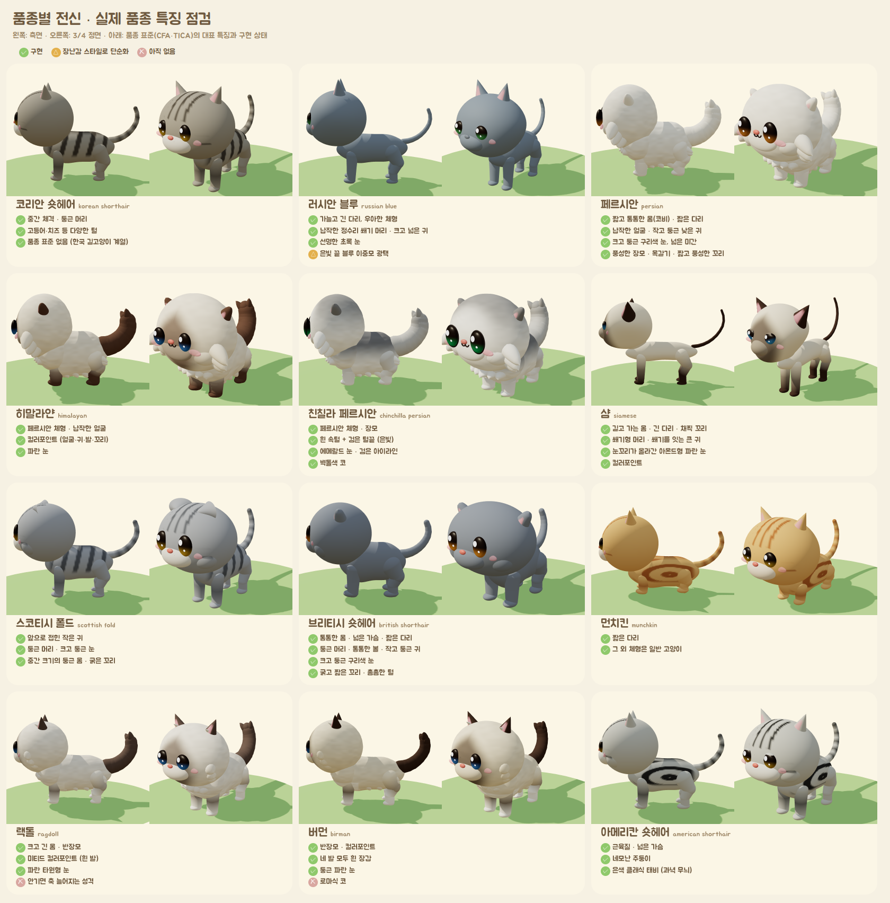
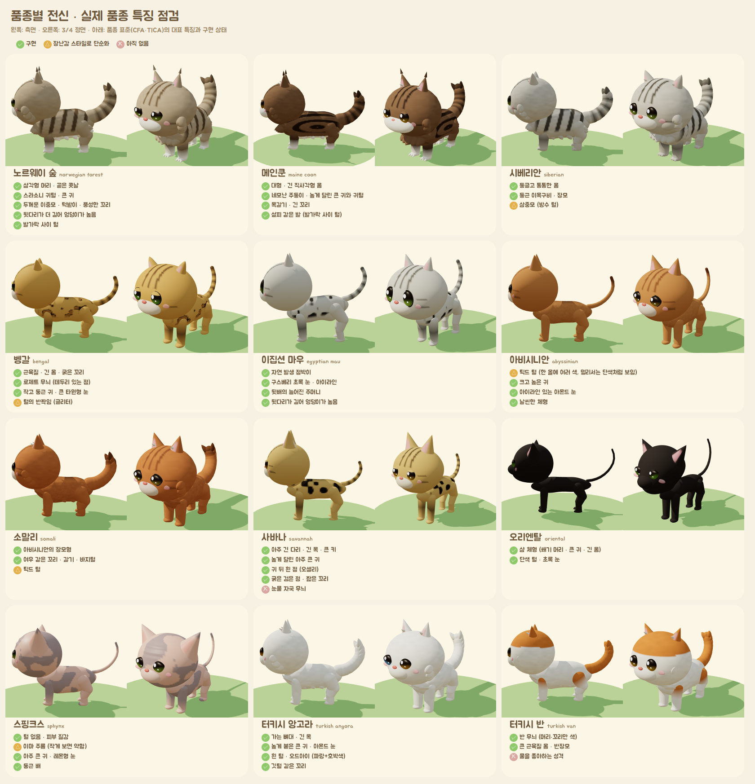
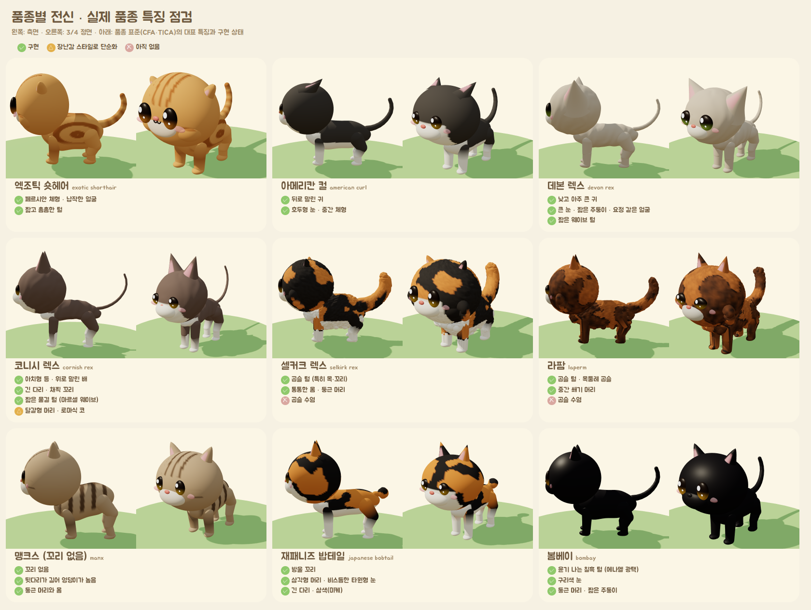

품종마다 CFA·TICA 품종 표준의 대표 특징을 `prototype/3d/breed_traits.js`에 정리하고 구현 상태를 표시했다(✓ 구현 / △ 단순화 / ✗ 없음).
`fullbody.html`이 각 품종의 측면과 3/4 정면 전신을 이 목록과 함께 보여준다. 나중에 게임 속 품종 도감에도 같은 데이터를 쓴다.

**점검 후 추가한 특징**

| 품종 | 특징 | 파라미터 |
|---|---|---|
| 메인쿤 · 노르웨이 숲 · 시베리안 | 발가락 사이 털 (설피 발) | `pawTuft` |
| 벵갈 | 테두리 있는 로제트 무늬 · 작고 둥근 귀 · 털 광택 | `rosette`, `sheen` |
| 사바나 | 귀 뒤 흰 점 (오셀리) · 크고 진한 점 | `earSpot`, `spotSize` |
| 터키시 앙고라 | 오드아이 (파랑 + 호박색) | `eye2` |
| 스핑크스 | 이마 주름 (볼록한 결) | `wrinkles` |
| 봄베이 · 러시안 블루 | 에나멜 같은 검은 광택 · 은빛 광택 | `sheen` |

**아직 없는 것 (✗)**
- 사바나의 눈물 자국 무늬
- 버먼의 로마식 코
- 셀커크 렉스·라팜의 곱슬 수염 (수염 자체를 아직 그리지 않는다)
- 성격 특성(랙돌, 터키시 반): 외형이 아니라 게임 속 행동으로 표현한다.

## 3. 털 파라미터 (`makeCoat`)

| 무늬 `pattern` | 국내 호칭 | 사용 색 |
|---|---|---|
| `solid` | 단색 (올블랙, 올화이트, 회색) | `base` |
| `mackerel` | 고등어 태비, 치즈 태비 | `base`, `dark` |
| `classic` | 클래식 태비 (아메리칸 숏헤어) | `base`, `dark` |
| `spotted` | 점박이 (벵갈) | `base`, `dark` |
| `ticked` | 틱드 (아비시니안) | `base`, `dark` |
| `tuxedo` / `bicolor` | 턱시도, 바이컬러 | `base` + 흰색 |
| `cow` | 젖소 | `base` + 흰색 (얼룩 노이즈) |
| `van` | 반 (머리와 꼬리만 색) | `base` + 흰색 |
| `calico` | 삼색이 | `base`, `second` + 흰색 |
| `tortie` | 카오스 | `base`, `second` (흰색 없음) |
| `point` | 포인트 (샴) | `base` 몸, `point` 얼굴·귀·발·꼬리 |
| `mitted` | 미티드 (랙돌) | 포인트 + 흰 발과 가슴 |
| `shaded` | 친칠라 / 셰이디드 | 흰 속털 + `dark` 털끝 (등·머리 위·꼬리에 진하게) |

공통 옵션도 있다.
- `whiteLevel`: 흰 털 비율 0~1
- `eye`: 눈 색
- `nose`: 코 색
- `lightMuzzle`: 주둥이를 밝게 할지 여부
- `seed`: 얼룩 배치 변형값

## 4. 사진 → 고양이 변환 (프로토타입 구현됨, 기기 안에서 처리, 서버 없음)


`prototype/3d/photo2cat.js`가 분석을 맡는다. 픽셀만 다루는 순수 함수라서 Swift나 C#으로 그대로 옮길 수 있다.

| 단계 | 프로토타입 (브라우저) | iOS 앱 |
|---|---|---|
| 1. 고양이 영역 분리 | MediaPipe DeepLab v3 (2.7MB, `cat`+`dog` 확률) | Vision 피사체 마스크 |
| 2. 눈 위치 | URL로 지정 (사진 위 점) | `VNDetectAnimalBodyPoseRequest` (iOS 17, 고양이 눈·귀·코 좌표) |
| 3. 조명 보정 | 약한 회색 세계 화이트밸런스 (보정 폭 0.88~1.15) + 노출 맞춤 | 같음 |
| 4. 색 군집 | Lab 공간 k-means (k=5, 고정 시드라 같은 사진 → 같은 고양이) | 같음 |
| 5. 무늬 판별 | 아래 규칙 | 같음 (이후 Core ML 분류기로 보강) |
| 6. 품종 추천 | 털 + 사용자 토글(접힌 귀·말린 귀·장모·곱슬·짧은 다리)로 3개 추천 | 같음 |

**무늬 판별 규칙 (순서대로)**
1. 진한 주황(채도 30 이상)과 검정이 각각 8% 넘게 섞여 있으면 → `calico`(흰 털 12% 이상) 또는 `tortie`.
   - 갈색 태비의 갈색은 채도가 낮아서 주황으로 세지 않는다.
2. 얼굴이 몸보다 18 이상 어둡거나, 어두운 털이 귀·발·꼬리처럼 가는 끝부분에만 있으면 → `point`.
   - 가는 끝부분은 마스크 가장자리까지의 거리로 잰다.
3. 흰 털이 90% 넘으면 흰 단색이다. 62% 넘으면 `van`(색이 머리 위에만) 또는 `cow`, 28% 넘으면 `tuxedo`.
   - 그보다 적으면 `whiteLevel`로 반영한다.
   - 흰 털은 밝고 색이 없으면서 주변도 함께 밝아야 한다(넓은 흰 덩어리).
   - 은색 태비의 밝은 줄과 러시안 블루의 은빛 털끝은 주변이 어두워서 흰 털로 세지 않는다.
   - 주둥이와 턱의 흰 털은 `lightMuzzle`로 따로 처리한다.
4. 줄무늬 점수 = (몸통 안쪽의 중간 크기 명암 대비 ÷ 바탕 밝기) + (명암이 바뀌는 횟수).
   - 2 이상이면 `mackerel`, 아니면 `solid`.
   - 머리와 마스크 가장자리는 빼고 잰다. 눈·코와 윤곽선이 줄무늬로 잘못 잡히기 때문이다.
   - 바탕이 아주 어두우면(검은 고양이) 햇빛 반사를 줄무늬로 보지 않는다.
5. 눈 색: 눈 점 주변에서 가장 채도 높은 1/3을 홍채로 본다. 붉은색이면 털을 잘못 잡은 것으로 보고 품종 기본 눈 색을 쓴다.
6. 게임 톤: 색을 살짝 밝고 깨끗하게 바꾼다. 거의 무채색인 털은 회색으로 정리해서, 조명 때문에 카키색이 되지 않게 한다.

**테스트 결과 (6장 모두 무늬 정답, 한 장당 약 0.1초)**

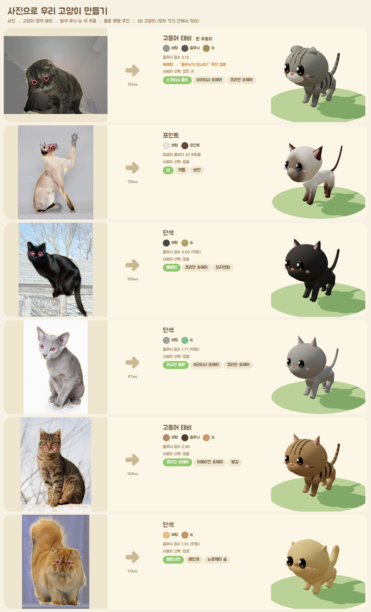

| 사진 | 결과 | 비고 |
|---|---|---|
| 로꼬 (어두운 실내, 노이즈 많음) | 고등어 태비 · 흰 주둥이 · 접힌 귀 → 스코티시 폴드 | 줄무늬 점수 2.12로 경계값 근처라 앱에서 "줄무늬가 있나요?"를 묻는다 |
| 샴 | 포인트 → 샴 | |
| 검은 고양이 (햇빛) | 단색 → 봄베이 | |
| 러시안 블루 | 회색 단색 → 러시안 블루 | 점수 1.71 (경계 근처, 확인 질문) |
| 갈색 태비 | 고등어 태비 → 코리안 숏헤어 | 점수 2.96 |
| 레드 페르시안 (파란 배경) | 크림 단색 + 장모 → 페르시안 | |

**회귀 테스트:** `node --test photo2cat.test.js`는 합성 이미지 9개로 각 규칙을 점검한다(단색·태비·삼색·반·포인트·검은 고양이·빈 마스크·결정성·품종 토글).

**한계와 다음 단계**
- 테스트 사진이 6장뿐이라 규칙의 기준값이 이 사진들에 맞춰져 있다. 그래서 결과 화면에서 무늬·색을 한 번에 고칠 수 있는 선택지를 반드시 둔다.
- 경계값 근처는 확인 질문으로 처리한다.
- 출시 전에 무늬별 사진 수백 장으로 기준값을 다시 맞춘다. 정확도가 부족하면 작은 Core ML 분류기(무늬 10종)를 추가한다.
- 클래식·점박이·틱드 태비 구분은 아직 하지 않는다. 기본값은 고등어이고, 사용자가 고른다.
- 테스트 사진 출처: Wikimedia Commons (`prototype/3d/fetch_assets.sh`에 원본 주소, 라이선스는 각 파일 페이지를 따른다).

## 5. 프로토타입 실행

```bash
cd cat-island/prototype/3d
npm install            # three.js, MediaPipe
./fetch_assets.sh      # 분할 모델 + 테스트 사진 (git에는 없음)
python3 -m http.server 8765
# 브라우저에서 확인
#   http://localhost:8765/catalog.html?mode=breeds   품종 프리셋
#   http://localhost:8765/catalog.html?mode=coats    털 무늬 프리셋
#   http://localhost:8765/walk.html?id=scottish_fold 걷기 동작 8프레임
#   http://localhost:8765/face.html                   전 품종 정면 얼굴 점검
#   http://localhost:8765/inspect.html?ids=a,b        다각도 점검 (정면·대각·측면·뒷면·위)
#   http://localhost:8765/silhouette.html             실루엣 점검 (색 없이 측면·정면)
#   http://localhost:8765/village.html               마을 그래픽 시안
#   http://localhost:8765/photo.html?items=tabby:.353,.32,.479,.32   사진 → 고양이
#        (items = 사진이름:눈1x,눈1y,눈2x,눈2y:ear=fold,fur=long:품종 ; 여러 장은 ; 로 구분, ?debug 는 줄무늬 신호 보기)
# 이미지로 저장 (Playwright 필요)
python3 render.py out.png "catalog.html?mode=breeds"   # 기본 포트 8766
```

브라우저 프로토타입(three.js)은 외형 설계를 빠르게 검증하는 용도다.
같은 파라미터와 생성 규칙을 Unity(C#)로 옮겨 실제 게임에서 쓴다.
