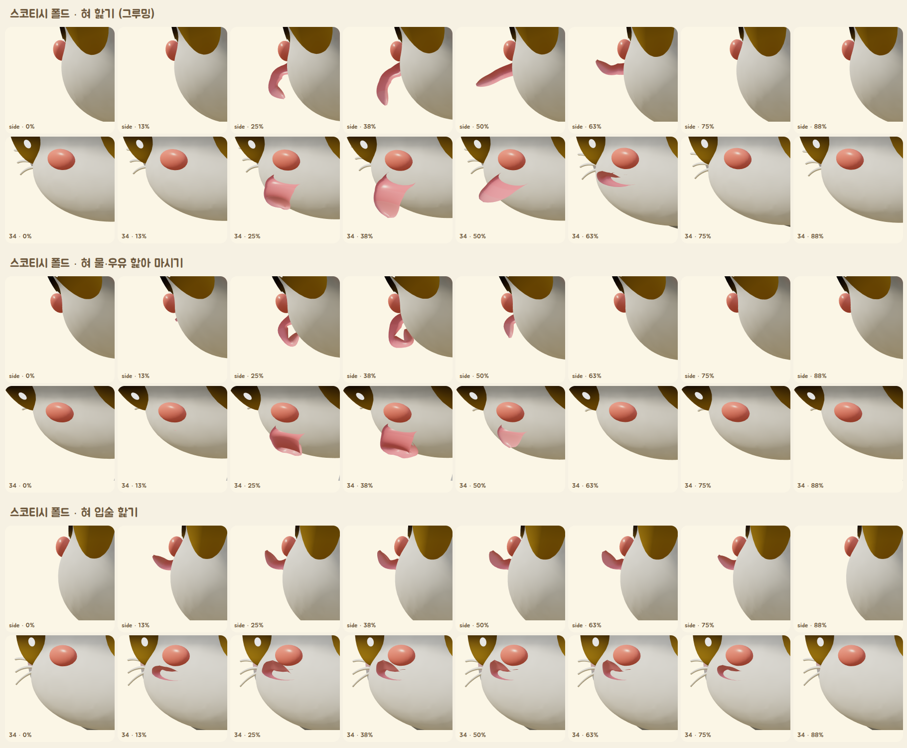
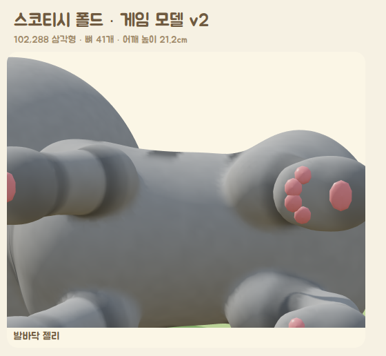
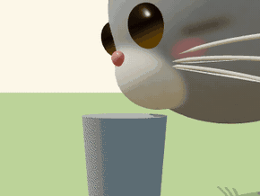
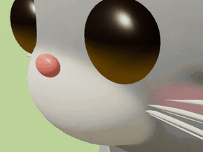
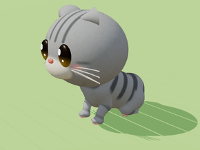

# 게임용 고양이 모델 v2 · 동작 데이터

카탈로그 생성기(`catgen.js`)는 품종 외형을 빠르게 설계하는 도구였다. 부품을 이어 붙인 구조라 관절에 이음새가 보였고, 동작도 매 프레임 공식으로 계산했다.
v2는 **실제 게임 캐릭터를 만드는 순서 그대로** 만든다.
- 하나로 이어진 모델, 뼈대, 스킨 가중치, 텍스처, 블렌드셰이프
- 키프레임 애니메이션 클립
- Blender로 마무리해 Unity에서 바로 쓰는 FBX와 glb로 내보낸다.


| 결과물 | 내용 |
|---|---|
| `assets/cats/<품종>.fbx` | Unity 기본 형식. 메시 + 뼈 43개 + 텍스처 내장 + 동작 21개 (얼굴 표정은 `Face_<동작>` 테이크) |
| `assets/cats/<품종>.glb` | glTF (Unity glTFast, 웹). 동작마다 몸과 표정이 한 클립에 들어 있음 |
| `assets/cats/<품종>.clips.json` | 동작 목록, 길이, 반복 여부, 루트 모션 속도·보폭, 점프 거리 |
| 수록 품종 | 코리안 숏헤어, 스코티시 폴드(로꼬), 페르시안. 나머지 30종은 같은 명령으로 만든다 |

## 1. 모델 만드는 과정 (`prototype/3d/catmodel.js`)

| 단계 | 하는 일 |
|---|---|
| 1. 뼈대 | 품종 파라미터로 관절 위치를 정한다. 다리는 실제 고양이처럼 **발가락으로 서는 구조**(지행성)다 |
| 2. 조각 | 뼈 주위에 타원체·둥근 원뿔을 놓고 **부드럽게 녹여 붙여** 한 덩어리로 만든다. 주둥이는 머리에, 어깨·엉덩이는 몸통에, 발가락 혹은 발에 이음새 없이 붙는다 (`sdfmesh.js`) |
| 3. 메시 | 조각을 삼각형 메시로 바꾸고, 계단 무늬를 다듬은 뒤 표면에 다시 붙인다 |
| 4. 스킨 | 각 정점이 가까운 부위의 뼈를 따르게 하고, 가중치를 표면을 따라 부드럽게 펴서 관절이 자연스럽게 접힌다 |
| 5. 칠 | 카탈로그와 같은 털 무늬(33종)에 발바닥 젤리(분홍 패드 4개 + 큰 패드), 볼터치를 칠한다 |
| 6. 얼굴 | 동물의 숲식 유광 눈, 코, 입, 수염을 별도 메시로 만들고 블렌드셰이프 2개를 단다. 혀는 뼈 3개로 움직인다 |
| 7. 발바닥 젤리 | 실제 조각된 발바닥 표면을 찾아 그 위에 볼록한 젤리를 붙인다: 발가락 젤리 4개 + 뒤가 오목한 큰 젤리 1개. 분홍색(검은 고양이는 짙은 갈색) |

**뼈대 (43개, 모든 품종 같은 이름·같은 구조라 동작을 공유한다)**

```
Root (땅, 루트 모션)
 └ Hips (골반)
    ├ Spine1 ─ Spine2 ─ Chest ─ Neck ─ Head ─ Ear_L / Ear_R, Tongue1 ─ … ─ Tongue5
    │   └ Belly (숨쉬기)        └ Scapula_L/R (견갑골) ─ UpperArm ─ Forearm ─ Hand ─ Fingers
    ├ Thigh_L/R ─ Shin ─ Foot (중족골, 고양이의 긴 '뒤꿈치') ─ Toes
    └ Tail1 … Tail10
```

- **척추 4마디:** 기지개(등 휘기), 잠(C자로 말기), 갤럽(접었다 펴기)처럼 몸이 크게 휘는 동작이 가능하다.
- **견갑골:** 걸을 때 앞다리가 땅을 딛는 동안 어깨뼈가 등 위로 솟았다 내려간다. 고양이 특유의 어깨 움직임이다.
- **발가락 뼈:** 발을 떼기 직전 뒤꿈치가 먼저 들리고 발가락이 마지막에 떨어진다. 발을 들 때는 발이 말린다.

**표정 블렌드셰이프:** `Blink`(동물의 숲식 'U'자 감은 눈), `MouthOpen`(하품·울기·물 마실 때).

**혀 (뼈 5개):**
- 모양: 가운데 홈이 있는 납작하고 둥근 숟가락 모양이다. 길이를 따라 고리 40개로 만들어 어디서 휘어도 매끈하고, 윗면에 돌기(유두) 무늬를 은은하게 넣었다.
- 평소에는 입 안에 숨어 있다. 입술 위치는 조각된 주둥이 표면에서 직접 재서, 혀가 정확히 입에서 나온다.
- **입술을 지난 부분만 휜다.** 각 뼈가 입 밖으로 나온 만큼만 굽혀서, 입 안에서 휘어 턱을 뚫고 나오는 일이 없다.
- 조절 값:
  - 내밀기
  - 전체 굽힘(아래/위)
  - 혀끝 말기(아래로 J자 / 위로 숟가락)
  - 좌우 휘두르기
- 혀가 나올 때 어두운 입 안이 보이고, 입술 선은 입 안으로 들어가서 혀를 가로지르지 않는다.



**혀 동작 3가지 (실제 고양이 기준):**

| 동작 | 순서 |
|---|---|
| 그루밍 핥기 (1회 약 0.45초) | 턱이 먼저 열림 → 혀가 앞·아래로 나오며 끝을 살짝 아래로 말아 털에 닿음 → **털을 누른 채 위·뒤로 쓸어 올림**(이때 고개가 같이 들림, 혀끝은 위로 젖혀짐) → 빠르게 들어감 → 턱이 한 박자 늦게 닫힘. 앞발도 혀 쪽으로 살짝 올라와 맞닿는다 |
| 물·우유 핥아 마시기 (초당 3.5회) | 혀가 아래로 뻗으며 끝을 **뒤로 접어 J자**로 만들고, 혀 윗면만 표면에 닿음 → 내려갈 때보다 훨씬 **빠르게 끌어올림**(우유 기둥이 따라 올라옴) → 혀가 들어간 직후 턱이 닫힘 ([Reis 외 2010, Science](https://engineering.princeton.edu/news/2010/11/11/perfect-balance-cats-drinking-offers-insights-biomechanics)) |
| 입술 핥기 (약 0.8초) | 혀끝을 위로 말아 윗입술과 코를 한쪽에서 다른 쪽으로 쓸고 들어감. 마시기가 끝날 때와 `LickLips` 동작에서 쓴다 |



## 2. 동작 데이터 (`prototype/3d/catmotion.js`)

애니메이터가 작업하는 방식 그대로 만들었다.
- 동작마다 핵심 자세(키 포즈)와 타이밍을 정하고, 겹침 동작을 더한다.
  - 꼬리는 마디마다 조금씩 늦게 따라온다.
  - 귀는 머리보다 늦게 따라온다.
  - 머리는 몸이 흔들려도 시선을 고정한다.
- 걸음은 발이 땅에 정확히 붙도록 발 위치를 먼저 정하고, 관절 각도를 거꾸로 계산한다.
  - 앞다리는 팔꿈치가 뒤로, 뒷다리는 무릎이 앞으로 굽는다.
- 이것을 **초당 30프레임**으로 뼈 회전값에 구워 일반 애니메이션 클립으로 저장한다.

**실제 고양이 데이터 기준:**
- 걷기 속도 0.62 m/s, 보폭 0.45–0.49 m, 한 주기 0.8 s, 땅을 딛는 시간 앞발 60%·뒷발 55% ([Stadig & Bergh 2013, 건강한 고양이 18마리 보행판 측정](https://pmc.ncbi.nlm.nih.gov/articles/PMC3701551/))
- 갤럽 발 순서: 회전 갤럽(뒷왼 → 뒷오 → 앞오 → 앞왼) ([Biancardi & Minetti 2012](https://www.originalwisdom.com/wp-content/uploads/bsk-pdf-manager/2019/10/Biancardi-and-Minetti_2012_Biomechanical-determinants-of-transverse-and-rotary-gallop-in-cursorial-mammals.pdf))
- 장난감 고양이는 다리가 짧으므로 동역학적 상사(프루드 수를 실제 고양이와 같게)로 다리 길이에 맞춰 줄였다.
  - 한 주기 시간은 √(다리 길이)에 비례한다.
  - 보폭은 짧은 다리가 실제로 닿는 범위 안으로 제한했다.

| 동작 | 미리보기 (스코티시 폴드, 30fps) | 길이 | 내용 |
|---|---|---|---|
| Idle |  | 6 s 반복 | 숨쉬기, 눈 깜빡임, 한쪽 귀 까딱, 고개 돌려 보기, 꼬리 살랑, 무게 이동 |
| Walk |  | 1.5 s 반복 · 0.40 m/s · 보폭 31 cm | 측대보 순서. 착지 → 하중을 받아 살짝 주저앉음 → 뒤꿈치 들고 발가락으로 떼기. 앞발은 들 때 손목이 뒤로 접혔다가 앞으로 뻗어 착지. 어깨뼈가 번갈아 솟고, 어깨와 골반이 반대로 흔들리고, 머리는 고정. 꼬리는 세우고 끝을 물음표처럼 |
| Trot |  | 0.8 s 반복 · 1.06 m/s | 대각선 짝(뒷왼+앞오, 뒷오+앞왼)으로 종종걸음, 꼬리는 수평 |
| Gallop |  | 0.87 s(3보) 반복 · 2.27 m/s | 회전 갤럽. 척추가 접혔다(뒷발이 가슴 밑으로) 펴지며(앞발 뻗기) 힘을 냄. 귀는 뒤로, 꼬리는 균형추 |
| JumpUp |  | 2.4 s | 웅크림 → 엉덩이 실룩(뒷발을 번갈아 고쳐 딛음) → 박차기 → 포물선 비행(실제 중력 9.81 m/s²) → 앞발 먼저 착지, 뒷발이 따라옴 → 충격 흡수 → 서기. 높이 20 cm, 거리 78 cm |
| SitDown · Sit · StandUp |  | 0.9 s · 4 s 반복 · 0.7 s | 엉덩이를 바닥에 붙이고 뒷발은 발바닥까지 납작하게, 앞다리는 어깨 아래 수직으로 세워 앉음. 꼬리로 앞발을 감쌈. 품종마다 엉덩이·어깨 높이로 몸 기울기를 계산한다(`fitSit`) |
| 그루밍 9종 | 아래 *그루밍* 참고 | | 앉거나 누워서만 한다 |
| LieDown · Loaf |  | 1.1 s · 5 s 반복 | 앞발을 손목에서 접어 넣고 배를 깔고 식빵 자세 |
| FallAsleep · Sleep |  | 2 s · 5 s 반복 | 식빵에서 C자로 몸을 말고 턱을 내려 잠듦. 천천히 깊게 숨쉬기 |
| Stretch |  | 4.2 s | 앞다리를 쭉 뻗는 기지개 + 크게 하품(입 벌림, 혀끝이 위로 말림, 눈 감음) → 뒷다리를 하나씩 뒤로 뻗기 |
| Drink |  | 3.0 s 반복 | 실제 고양이가 마시는 방식([Reis 외 2010, Science](https://engineering.princeton.edu/news/2010/11/11/perfect-balance-cats-drinking-offers-insights-biomechanics)): 혀끝을 아래로 J자로 접어 **윗면만** 우유 표면에 살짝 대고, 빠르게 끌어올리면 우유 기둥이 따라 올라온다. 그 순간 입을 닫는다. 초당 3.5번, 8번 핥고, 고개를 살짝 들어 삼킨 뒤 입술을 핥는다. 미리보기는 우유 기둥까지 그린다 |
| LickLips |  | 1.4 s | 앉아서 입술과 코를 한 번 핥음 (먹거나 마신 뒤) |
| Flop · FlopIdle |  | 1.6 s · 4 s 반복 | 옆으로 발라당 누워 배를 보임, 꼬리 끝만 까딱 (랙돌 성격) |
| PawBat |  | 1.4 s 반복 | 앞발을 들어 톡 치기 (터키시 반이 물그릇을 칠 때) |

### 그루밍 (앉아서, 실제로 닿는 동작만)

고양이는 서서 그루밍하지 않는다. 그루밍은 머리에서 꼬리 쪽으로 이어지는 순서가 있다(cephalocaudal). 실제 고양이가 입으로 하는 그루밍 시간의 부위별 비율([Eckstein & Hart 2000, *Appl. Anim. Behav. Sci.* 68:131](https://doi.org/10.1016/S0168-1591(00)00094-0))은 얼굴 31 %, 뒷다리 21 %, 옆구리·등 13 %, 목·가슴 11 %, 항문·생식기 10 %, 배 9 %, 꼬리 5 %다.

**이 캐릭터는 몸 앞쪽만 그루밍한다.**
- 머리가 몸통만큼 크고 다리와 꼬리가 짧다. 그래서 입이 몸 뒤쪽에 닿지 않는다.
- 실제 메시로 재 보면 옆구리는 25mm, 누워서 뒷다리는 약 200mm, 배는 120mm, 꼬리는 250mm 모자란다. 몸을 말거나 고개를 최대한 돌려도 마찬가지다.
- 그래서 혀가 닿지 않는 동작은 넣지 않았다. 귀도 앞발과 뒷발이 닿지 않아서, 뒷발 긁기는 귀 아래 목덜미를 긁는다.
- **가슴 핥기도 뺐다.** 턱을 당기면 큰 머리가 가슴 위에 얹혀서, 혀가 가슴 털을 쓸지 못하고 앞으로 늘어지기만 한다(메시 측정과 렌더링으로 확인).
- 순서와 비율은 `GROOM_ROUTINE`(`catmotion.js`)과 각 품종의 `clips.json`의 `groomRoutine`에 들어 있다.

| 동작 | 미리보기 | 길이 | 내용 (모두 앉은 자세에서 시작해서 앉은 자세로 끝남) |
|---|---|---|---|
| GroomFace |  | 6.6 s 반복 | 앞발을 가슴 앞에 조금 들고 고개를 숙여 혀로 4번 핥는다. 이어서 고개를 숙이고 기울여 수염 패드에서 주둥이까지를 발에 두 번 문지르고(세수), 다시 2번 핥은 뒤 발을 내린다. |
| ScratchEar |  | 3 s 반복 | 몸을 기울이고, 뒷발을 엉덩이 바깥으로 돌려 올려 귀 아래 목덜미를 초당 7번 긁는다. 머리를 발 쪽으로 기울이고 눈을 질끈 감는다. |
| NibbleClaws |  | 3.4 s 반복 | 앞발을 조금 들어 발가락을 벌리고, 고개를 숙이고 옆으로 돌려 입 옆으로 발톱을 씹는다. |

**닿는 동작을 만드는 방법** (`catmotion.js`의 `touch`, `catcontact.js`)
- **접촉 맞추기:** 혀·발·뒷발 정점과 닿을 부위 표면 사이의 거리를 실제 스킨 메시에서 잰다. 그 거리가 0이 되도록 목·머리·발 IK 목표를 함께 푼다(감쇠 최소제곱).
- **박힘 막기:** 이때 다른 부분이 박히지 않아야 한다는 조건도 같이 푼다. 팔뚝이 머리나 가슴에, 머리가 발에, 혀가 발 속으로 들어가면 안 된다.
- **핥기 궤적:** 한 번 핥는 동안 혀가 털 위를 미끄러지도록, 구간마다 머리 각도와 혀를 내민 정도를 보정한다. 가운데 구간에서는 털을 약간 누르고, 나머지 구간에서는 박히지 않게만 한다.
- **혀 길이:** 그루밍할 때 혀가 평소보다 길게 나온다(`tongueStretch`, 혀 뼈 간격을 최대 2.2배로). 이 큰 머리에 원래 혀 길이로는 박힘 없이 발에 닿을 수 없기 때문이다. 물 마시기도 품종마다 필요한 만큼만 늘인다(아래 '용품과 함께'). 입술 핥기는 원래 길이를 쓴다.
- **마지막 프레임 보정:** 동작을 다 만든 뒤 모든 프레임에서 한 번 더 혀 길이를 맞춘다. 핥는 가운데 구간에서는 털에 닿고, 그 밖에서는 털 속으로 들어가지 않게 한다. 숨쉬기나 바닥 보정으로 자세가 조금 바뀌어도 맞는다.
- **세수 범위:** 앞다리가 짧아 큰 머리를 돌아 닿지 못한다. 그래서 발은 가슴 앞에 낮게 두고 머리가 발로 다가간다. 볼 위쪽·눈·귀는 팔이 닿지 않아서(팔뚝이 머리에 박힘) 세수는 수염 패드와 주둥이만 한다.
- **계산 모델:** 접촉 계산은 같은 고양이를 낮은 해상도로 만든 모델(`solveRig`)에서 한다. 뼈와 비율이 같아서 결과 자세를 그대로 쓸 수 있다.

### 동작 점검 (`qa.mjs`)

모든 동작을 프레임마다 실제 스킨 메시로 검사한다.
- 다리와 발바닥 젤리가 몸·머리·다른 다리에 박히는지 (4mm 넘으면 실패)
- 몸이 바닥을 뚫는지
- 혀와 발이 닿아야 할 때 실제로 닿는지 (3mm 이내), 너무 깊이 들어가지는 않는지

```bash
node qa.mjs korean_shorthair,scottish_fold,persian            # 모든 동작
node qa.mjs scottish_fold GroomFace,ScratchEar --fps 30       # 일부만, 더 촘촘하게
```

이 점검으로 찾아 고친 오류:
- **발바닥 젤리가 몸 밖으로 보이던 오류:** 배 뼈(Belly)가 뒷발 정점까지 붙잡고 있어서, 숨 쉬거나 움직일 때 발이 몸으로 끌려 들어갔다.
- **바닥 뚫림:** 서 있을 때 발이 8mm, 앉을 때 엉덩이가 25mm, 식빵 자세에서 몸이 42mm, 발라당에서 머리가 10cm 바닥 아래로 들어가 있었다. 지금은 자세마다 메시 높이를 재서 바닥 위에 올린다(`settle`).
- **전환 동작:** 앉기·눕기 같은 전환 중에는 발이 몸 옆으로 돌아서 지나간다.
- **뛰기 동작:** 갤럽에서 뒷다리가 앞다리 바깥으로 지나가고, 점프에서는 웅크림을 얕게 했다.

- **측정 오판:** 표면이 접힌 곳(앞다리 사이 가슴)에서 바깥 점을 안쪽으로 잘못 판정하던 문제가 있었다. 지금은 깊은 점마다 부위의 상자와 광선 교차(4방향 중 3방향)로 다시 확인한다.
- **바닥:** 모든 동작에 매 프레임 바닥 보정을 한다. 발바닥 젤리까지 포함하고, 점프 뒤에는 캣타워 판을 바닥으로 삼는다.
- **사이 프레임:** 몸 보정(`settle`)을 몇 군데에서만 하면, 그 사이 프레임에서 다리가 몸을 스칠 수 있었다. 지금은 프레임마다 검사해서 걸리는 프레임과 그 앞뒤도 보정한다.

**출시 안전장치:** 그루밍 동작(앞발 핥기·세수, 귀 긁기, 발톱 물기)은 품종마다 만든 직후 프레임마다 같은 기준으로 검사한다. 하나라도 넘으면 그 품종에서는 그 동작을 빼고, 이유를 `clips.json`의 `skippedClips`에 적는다. 게임은 `groomRoutine`에 남은 동작만 재생하면 된다. 달리기(Gallop)와 앞발 장난(PawBat)도 같은 검사를 하고, 걸리면 빼고 대신 빠르게 걷기(Trot)·서 있기(Idle)를 재생하도록 `playInstead`에 적는다. 그래서 겹치거나 닿지 않는 동작은 게임에 들어가지 않는다.

<!-- skipped-table:start -->
**품종별 동작 수** (점검을 통과한 동작만 들어 있다. `→`는 그 대신 재생할 동작으로, `clips.json`의 `skippedClips[].playInstead`에 적혀 있다.)

| 품종 | 파일 | 동작 수 | 빠진 동작 |
|---|---|---|---|
| 코리안 숏헤어 | `korean_shorthair` | 22 | 없음 (2026-10-05 새로 만듦: 귀 긁기 통과, 내려오기 JumpDown 추가) |
| 러시안 블루 | `russian_blue` | 20 | 귀 긁기 |
| 페르시안 | `persian` | 19 | 얼굴 씻기, 발톱 다듬기 |
| 히말라얀 | `himalayan` | 19 | 얼굴 씻기, 발톱 다듬기 |
| 친칠라 페르시안 | `chinchilla_persian` | 20 | 얼굴 씻기 |
| 샴 | `siamese` | 18 | 얼굴 씻기, 귀 긁기, 발톱 다듬기 |
| 스코티시 폴드 | `scottish_fold` | 18 | 달리기 → 빠르게 걷기, 얼굴 씻기, 귀 긁기 |
| 브리티시 숏헤어 | `british_shorthair` | 18 | 얼굴 씻기, 귀 긁기, 발톱 다듬기 |
| 먼치킨 | `munchkin` | 18 | 얼굴 씻기, 귀 긁기, 발톱 다듬기 |
| 랙돌 | `ragdoll` | 20 | 귀 긁기 |
| 버먼 | `birman` | 20 | 귀 긁기 |
| 아메리칸 숏헤어 | `american_shorthair` | 18 | 달리기 → 빠르게 걷기, 얼굴 씻기, 귀 긁기 |
| 노르웨이 숲 | `norwegian_forest` | 19 | 얼굴 씻기, 발톱 다듬기 |
| 메인쿤 | `maine_coon` | 20 | 귀 긁기 |
| 시베리안 | `siberian` | 19 | 얼굴 씻기, 귀 긁기 |
| 벵갈 | `bengal` | 18 | 얼굴 씻기, 귀 긁기, 발톱 다듬기 |
| 이집션 마우 | `egyptian_mau` | 19 | 얼굴 씻기, 귀 긁기 |
| 아비시니안 | `abyssinian` | 20 | 귀 긁기 |
| 소말리 | `somali` | 20 | 귀 긁기 |
| 사바나 | `savannah` | 19 | 달리기 → 빠르게 걷기, 귀 긁기 |
| 오리엔탈 | `oriental` | 19 | 달리기 → 빠르게 걷기, 귀 긁기 |
| 스핑크스 | `sphynx` | 19 | 달리기 → 빠르게 걷기, 귀 긁기 |
| 터키시 앙고라 | `turkish_angora` | 20 | 귀 긁기 |
| 터키시 반 | `turkish_van` | 20 | 귀 긁기 |
| 엑조틱 숏헤어 | `exotic_shorthair` | 20 | 귀 긁기 |
| 아메리칸 컬 | `american_curl` | 20 | 귀 긁기 |
| 데본 렉스 | `devon_rex` | 20 | 귀 긁기 |
| 코니시 렉스 | `cornish_rex` | 19 | 달리기 → 빠르게 걷기, 발톱 다듬기 |
| 셀커크 렉스 | `selkirk_rex` | 20 | 얼굴 씻기 |
| 라팜 | `laperm` | 20 | 얼굴 씻기 |
| 맹크스 (꼬리 없음) | `manx` | 19 | 귀 긁기, 발톱 다듬기 |
| 재패니즈 밥테일 | `japanese_bobtail` | 18 | 달리기 → 빠르게 걷기, 얼굴 씻기, 귀 긁기 |
| 봄베이 | `bombay` | 18 | 달리기 → 빠르게 걷기, 얼굴 씻기, 귀 긁기 |

빠진 횟수: 귀 긁기 26종, 얼굴 씻기 16종, 발톱 다듬기 9종, 달리기 8종.
<!-- skipped-table:end -->

경고로만 표시하는 것:
- 큰 머리가 자기 가슴·어깨에 얹히는 겹침. 머리 안에 가려 보이지 않는다.
- 장모·곱슬 품종의 다리가 몸통 털이나 옆 다리 털에 12mm 안으로 묻히는 것. 털 속이라 보이지 않는다.

**JumpDown (2026-10-05 추가):** 캣타워 판에서 올라온 쪽으로 내려온다. JumpUp 착지 자리에서 돌아서며 판 안쪽으로 `jump.turnIn`(5 cm) 들어온 뒤(바로 돌아서면 앞발이 판 테두리에 올라감), 내려다보고 웅크렸다가 낮게 뛰어내려 앞발부터 착지한다. `jump: { D, H(음수), edge, turnIn }`. `qa_items.mjs`의 `JumpDown · cat_tower_1` 장면으로 점검한다 (코리안 숏헤어·먼치킨·메인쿤 통과).

**귀 긁기 (2026-10-05 고침):** 몸통 비틀기(spRoll)로 머리를 발 쪽에 기울여 닿게 하고, 목·머리 돌림(±0.25)과 숙임(0.35 이하)은 원래 디자인 범위로 묶어 얼굴이 보이게 했다. 닿는 자세는 털에서 2 mm, 긁는 폭은 절반(초당 7번 그대로). 시작·끝 순서: 디딘 뒷발이 바깥으로 돌아 나간 뒤 몸을 비틀고, 머리를 먼저 세운 뒤 발을 내린다. 대표 4종(코리안·브리티시·스코티시 폴드·스핑크스) 프레임별 점검 통과. 나머지 품종은 다시 만들 때 확인한다. 빠른 확인: `node reach.mjs <품종> --clips=ScratchEar --verify`.

**루트 모션:**
- Walk, Trot, Gallop, JumpUp은 클립 안에서 고양이가 실제로 앞으로 이동한다.
- Unity에서 *Apply Root Motion*을 켜면 발이 미끄러지지 않고 그만큼 이동한다.
- 다른 동작은 제자리 동작이다.

## 3. 게임 에셋 마무리 (`prototype/3d/blender_finish.py`, Blender 4.2)

1. **폴리곤 줄이기:** 조각 메시 약 10만 삼각형을 몸 14,000 삼각형(모바일 기준)으로 줄인다. 스킨 가중치는 유지된다. 얼굴 메시(눈·코·입·혀·수염·발바닥 젤리)는 약 10,500 삼각형이다.
2. **UV 펼치기:** 몸을 자동으로 펼친다. 얼굴은 수염처럼 가는 부분이 자동 전개에서 잘게 쪼개지므로, 생성기가 직접 색 아틀라스(64px)를 배치한다.
3. **베이크:** 고해상도 조각의 털 무늬를 저해상도 메시에 **코트 텍스처(2048px)** 로 굽는다. 발가락 혹·주둥이 경계 같은 조각 디테일은 **노멀맵(1024px)** 으로 굽는다.
4. **내보내기:** FBX(Unity 축 설정: Forward −Z, Up Y, 텍스처 내장)와 glb.
5. **검증:** 다시 불러와서 메시, 뼈, 블렌드셰이프, 21개 동작이 모두 있는지 확인한다. 완성 파일과 원본 모델을 같은 프레임에서 렌더링해 자세가 같은지도 비교한다. glb는 표준 애니메이션 플레이어(three.js AnimationMixer)로 재생해서 위 GIF를 만들었다.

**Unity에서 쓰기**
- **FBX:**
  - Rig 탭에서 *Animation Type: Generic*, *Root node: Root*로 설정한다.
  - Animation 탭에서 클립별 *Loop Time*을 켠다(`clips.json`의 `loop`).
  - 표정 테이크(`Face_<동작>`)는 Animator의 두 번째 레이어에 같은 동작을 넣는다.
  - 또는 스크립트로 `SetBlendShapeWeight`를 써서 깜빡임을 준다.
- **glb:** glTFast 패키지로 불러오면 몸과 표정이 한 클립에 들어 있다.

## 4. 다시 만들기

```bash
cd cat-island/prototype/3d
npm install && pip install playwright bpy          # bpy = Blender 4.2 파이썬 모듈
python3 -m http.server 8766 &
python3 export_cats.py OUT korean_shorthair,munchkin   # 조각·스킨·동작 → OUT/<id>_raw.glb (+ .json)
python3 blender_finish.py OUT/munchkin_raw.glb OUT munchkin   # → munchkin.fbx / .glb / 텍스처
# 확인용 페이지
#   model.html?id=persian                  모델 점검 (정면·측면·변형 테스트)
#   motion2.html?clip=Walk,Gallop&n=8      동작 단계별 정지 화면
#   play2.html?glb=out/x.glb&clip=Walk&live   완성 에셋 재생
#   assets_view.html                      완성 에셋 비교
python3 make_gif2.py walk.gif "glb=out/x.glb&clip=Walk&view=side" 2   # 30fps GIF
```

## 5. 한계와 다음 단계

- **동작 품질:** 동작은 실제 고양이 데이터와 동물 동작 원리로 만든 키 포즈이고, 모션 캡처가 아니다. 실제 영상과 프레임 단위로 대조하며 다듬을 여지가 있다. 특히 갤럽과 점프의 공중 자세가 그렇다.
- **수록 품종:** 지금은 3종만 에셋으로 넣었다. 품종마다 체형이 달라 발 위치가 달라지므로, 동작은 품종별로 구워 넣는다.
- **Unity 통합:** 프로젝트 쪽 작업이 남았다. Animator 상태 전이(걷기 ↔ 종종걸음 ↔ 갤럽 블렌드 트리, 앉기·식빵·잠 전이)와 사진 털색을 텍스처에 다시 칠하는 기능을 만들어야 한다.
