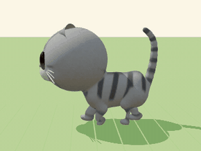
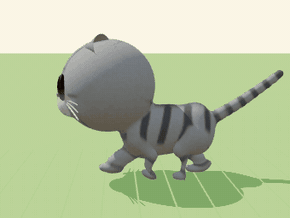
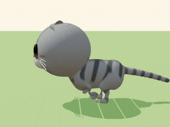
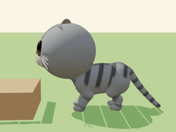
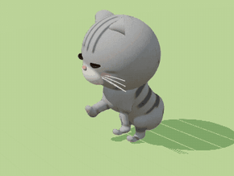
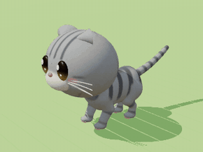
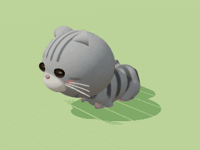
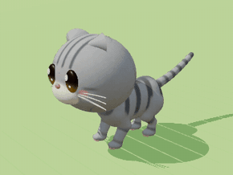

# 게임용 고양이 모델 v2 · 동작 데이터

카탈로그 생성기(`catgen.js`)는 품종 외형을 빠르게 설계하는 도구였다. 부품을 이어 붙인 구조라 관절에 이음새가 보였고, 동작도 매 프레임 공식으로 계산했다.
v2는 **실제 게임 캐릭터를 만드는 순서 그대로** 만든다.
- 하나로 이어진 모델, 뼈대, 스킨 가중치, 텍스처, 블렌드셰이프
- 키프레임 애니메이션 클립
- Blender로 마무리해 Unity에서 바로 쓰는 FBX와 glb로 내보낸다.


| 결과물 | 내용 |
|---|---|
| `assets/cats/<품종>.fbx` | Unity 기본 형식. 메시 + 뼈 38개 + 텍스처 내장 + 동작 17개 (얼굴 표정은 `Face_<동작>` 테이크) |
| `assets/cats/<품종>.glb` | glTF (Unity glTFast, 웹). 동작마다 몸과 표정이 한 클립에 들어 있음 |
| `assets/cats/<품종>.clips.json` | 동작 목록, 길이, 반복 여부, 루트 모션 속도·보폭, 점프 거리 |
| 수록 품종 | 코리안 숏헤어, 스코티시 폴드(로꼬), 페르시안. 나머지 30종은 같은 명령으로 만든다 |

## 1. 모델 만드는 과정 (`prototype/3d/catmodel.js`)

| 단계 | 하는 일 |
|---|---|
| 1. 뼈대 | 품종 파라미터로 관절 위치를 정한다. 다리는 실제 고양이처럼 **발가락으로 서는 구조**(지행성)다 |
| 2. 조각 | 뼈 주위에 타원체·둥근 원뿔을 놓고 **부드럽게 녹여 붙여** 한 덩어리로 만든다. 주둥이는 머리에, 어깨·엉덩이는 몸통에, 발가락 혹은 발에 이음새 없이 붙는다 (`sdfmesh.js`) |
| 3. 메시 | 조각을 삼각형 메시로 바꾸고, 계단 무늬를 다듬은 뒤 표면에 다시 붙인다 |
| 4. 스킨 | 각 정점이 가까운 부위의 뼈를 따르게 하고, 가중치를 표면을 따라 부드럽게 펴서 관절이 자연스럽게 접힌다 |
| 5. 칠 | 카탈로그와 같은 털 무늬(33종)에 발바닥 젤리(분홍 패드 4개 + 큰 패드), 볼터치를 칠한다 |
| 6. 얼굴 | 동물의 숲식 유광 눈, 코, 입, 수염을 별도 메시로 만들고 블렌드셰이프 3개를 단다 |

**뼈대 (38개, 모든 품종 같은 이름·같은 구조라 동작을 공유한다)**

```
Root (땅, 루트 모션)
 └ Hips (골반)
    ├ Spine1 ─ Spine2 ─ Chest ─ Neck ─ Head ─ Ear_L / Ear_R
    │   └ Belly (숨쉬기)        └ Scapula_L/R (견갑골) ─ UpperArm ─ Forearm ─ Hand ─ Fingers
    ├ Thigh_L/R ─ Shin ─ Foot (중족골, 고양이의 긴 '뒤꿈치') ─ Toes
    └ Tail1 … Tail10
```

- **척추 4마디:** 기지개(등 휘기), 잠(C자로 말기), 갤럽(접었다 펴기)처럼 몸이 크게 휘는 동작이 가능하다.
- **견갑골:** 걸을 때 앞다리가 땅을 딛는 동안 어깨뼈가 등 위로 솟았다 내려간다. 고양이 특유의 어깨 움직임이다.
- **발가락 뼈:** 발을 떼기 직전 뒤꿈치가 먼저 들리고 발가락이 마지막에 떨어진다. 발을 들 때는 발이 말린다.

**표정 블렌드셰이프:** `Blink`(동물의 숲식 'U'자 감은 눈), `MouthOpen`(하품·울기), `Tongue`(그루밍).

## 2. 동작 데이터 (`prototype/3d/catmotion.js`)

애니메이터가 작업하는 방식 그대로 만들었다.
- 동작마다 핵심 자세(키 포즈)와 타이밍을 정하고, 겹침 동작을 더한다.
  - 꼬리는 마디마다 조금씩 늦게 따라온다.
  - 귀는 머리보다 늦게 따라온다.
  - 머리는 몸이 흔들려도 시선을 고정한다.
- 걸음은 발이 땅에 정확히 붙도록 발 위치를 먼저 정하고, 관절 각도를 거꾸로 계산한다.
  - 앞다리는 팔꿈치가 뒤로, 뒷다리는 무릎이 앞으로 굽는다.
- 이것을 **초당 30프레임**으로 뼈 회전값에 구워 일반 애니메이션 클립으로 저장한다.

**실제 고양이 데이터 기준:**
- 걷기 속도 0.62 m/s, 보폭 0.45–0.49 m, 한 주기 0.8 s, 땅을 딛는 시간 앞발 60%·뒷발 55% ([Stadig & Bergh 2013, 건강한 고양이 18마리 보행판 측정](https://pmc.ncbi.nlm.nih.gov/articles/PMC3701551/))
- 갤럽 발 순서: 회전 갤럽(뒷왼 → 뒷오 → 앞오 → 앞왼) ([Biancardi & Minetti 2012](https://www.originalwisdom.com/wp-content/uploads/bsk-pdf-manager/2019/10/Biancardi-and-Minetti_2012_Biomechanical-determinants-of-transverse-and-rotary-gallop-in-cursorial-mammals.pdf))
- 장난감 고양이는 다리가 짧으므로 동역학적 상사(프루드 수를 실제 고양이와 같게)로 다리 길이에 맞춰 줄였다.
  - 한 주기 시간은 √(다리 길이)에 비례한다.
  - 보폭은 짧은 다리가 실제로 닿는 범위 안으로 제한했다.

| 동작 | 미리보기 (스코티시 폴드, 30fps) | 길이 | 내용 |
|---|---|---|---|
| Idle |  | 6 s 반복 | 숨쉬기, 눈 깜빡임, 한쪽 귀 까딱, 고개 돌려 보기, 꼬리 살랑, 무게 이동 |
| Walk |  | 1.5 s 반복 · 0.40 m/s · 보폭 31 cm | 측대보 순서. 착지 → 하중을 받아 살짝 주저앉음 → 뒤꿈치 들고 발가락으로 떼기. 앞발은 들 때 손목이 뒤로 접혔다가 앞으로 뻗어 착지. 어깨뼈가 번갈아 솟고, 어깨와 골반이 반대로 흔들리고, 머리는 고정. 꼬리는 세우고 끝을 물음표처럼 |
| Trot |  | 0.8 s 반복 · 1.06 m/s | 대각선 짝(뒷왼+앞오, 뒷오+앞왼)으로 종종걸음, 꼬리는 수평 |
| Gallop |  | 0.87 s(3보) 반복 · 2.27 m/s | 회전 갤럽. 척추가 접혔다(뒷발이 가슴 밑으로) 펴지며(앞발 뻗기) 힘을 냄. 귀는 뒤로, 꼬리는 균형추 |
| JumpUp |  | 2.4 s | 웅크림 → 엉덩이 실룩(뒷발을 번갈아 고쳐 딛음) → 박차기 → 포물선 비행(실제 중력 9.81 m/s²) → 앞발 먼저 착지, 뒷발이 따라옴 → 충격 흡수 → 서기. 높이 20 cm, 거리 78 cm |
| SitDown · Sit · StandUp |  | 0.9 s · 4 s 반복 · 0.7 s | 뒷다리를 접어 뒤꿈치까지 바닥에 대고 앉고, 꼬리로 앞발을 감쌈 |
| Groom |  | 4.8 s 반복 | 앞발을 입 앞으로 들어 혀로 세 번 핥고, 그 발로 얼굴과 귀를 두 번 닦음 |
| LieDown · Loaf |  | 1.1 s · 5 s 반복 | 앞발을 손목에서 접어 넣고 배를 깔고 식빵 자세 |
| FallAsleep · Sleep |  | 2 s · 5 s 반복 | 식빵에서 C자로 몸을 말고 턱을 내려 잠듦. 천천히 깊게 숨쉬기 |
| Stretch |  | 4.2 s | 앞다리를 쭉 뻗는 기지개 + 크게 하품(입 벌림, 혀, 눈 감음) → 뒷다리를 하나씩 뒤로 뻗기 |
| Flop · FlopIdle |  | 1.6 s · 4 s 반복 | 옆으로 발라당 누워 배를 보임, 꼬리 끝만 까딱 (랙돌 성격) |
| PawBat |  | 1.4 s 반복 | 앞발을 들어 톡 치기 (터키시 반이 물그릇을 칠 때) |

**루트 모션:**
- Walk, Trot, Gallop, JumpUp은 클립 안에서 고양이가 실제로 앞으로 이동한다.
- Unity에서 *Apply Root Motion*을 켜면 발이 미끄러지지 않고 그만큼 이동한다.
- 다른 동작은 제자리 동작이다.

## 3. 게임 에셋 마무리 (`prototype/3d/blender_finish.py`, Blender 4.2)

1. **폴리곤 줄이기:** 조각 메시 약 10만 삼각형을 몸 14,000 + 얼굴 6,000 삼각형(모바일 기준)으로 줄인다. 스킨 가중치는 유지된다.
2. **UV 펼치기:** 몸을 자동으로 펼친다. 얼굴은 수염처럼 가는 부분이 자동 전개에서 잘게 쪼개지므로, 생성기가 직접 색 아틀라스(64px)를 배치한다.
3. **베이크:** 고해상도 조각의 털 무늬를 저해상도 메시에 **코트 텍스처(2048px)** 로 굽는다. 발가락 혹·주둥이 경계 같은 조각 디테일은 **노멀맵(1024px)** 으로 굽는다.
4. **내보내기:** FBX(Unity 축 설정: Forward −Z, Up Y, 텍스처 내장)와 glb.
5. **검증:** 다시 불러와서 메시, 뼈, 블렌드셰이프, 17개 동작이 모두 있는지 확인한다. glb는 표준 애니메이션 플레이어(three.js AnimationMixer)로 재생해서 위 GIF를 만들었다.

**Unity에서 쓰기**
- **FBX:**
  - Rig 탭에서 *Animation Type: Generic*, *Root node: Root*로 설정한다.
  - Animation 탭에서 클립별 *Loop Time*을 켠다(`clips.json`의 `loop`).
  - 표정 테이크(`Face_<동작>`)는 Animator의 두 번째 레이어에 같은 동작을 넣는다.
  - 또는 스크립트로 `SetBlendShapeWeight`를 써서 깜빡임을 준다.
- **glb:** glTFast 패키지로 불러오면 몸과 표정이 한 클립에 들어 있다.

## 4. 다시 만들기

```bash
cd cat-island/prototype/3d
npm install && pip install playwright bpy          # bpy = Blender 4.2 파이썬 모듈
python3 -m http.server 8766 &
python3 export_cats.py OUT korean_shorthair,munchkin   # 조각·스킨·동작 → OUT/<id>_raw.glb (+ .json)
python3 blender_finish.py OUT/munchkin_raw.glb OUT munchkin   # → munchkin.fbx / .glb / 텍스처
# 확인용 페이지
#   model.html?id=persian                  모델 점검 (정면·측면·변형 테스트)
#   motion2.html?clip=Walk,Gallop&n=8      동작 단계별 정지 화면
#   play2.html?glb=out/x.glb&clip=Walk&live   완성 에셋 재생
#   assets_view.html                      완성 에셋 비교
python3 make_gif2.py walk.gif "glb=out/x.glb&clip=Walk&view=side" 2   # 30fps GIF
```

## 5. 한계와 다음 단계

- **동작 품질:** 동작은 실제 고양이 데이터와 동물 동작 원리로 만든 키 포즈이고, 모션 캡처가 아니다. 실제 영상과 프레임 단위로 대조하며 다듬을 여지가 있다. 특히 갤럽과 점프의 공중 자세가 그렇다.
- **수록 품종:** 지금은 3종만 에셋으로 넣었다. 품종마다 체형이 달라 발 위치가 달라지므로, 동작은 품종별로 구워 넣는다.
- **Unity 통합:** 프로젝트 쪽 작업이 남았다. Animator 상태 전이(걷기 ↔ 종종걸음 ↔ 갤럽 블렌드 트리, 앉기·식빵·잠 전이)와 사진 털색을 텍스처에 다시 칠하는 기능을 만들어야 한다.
